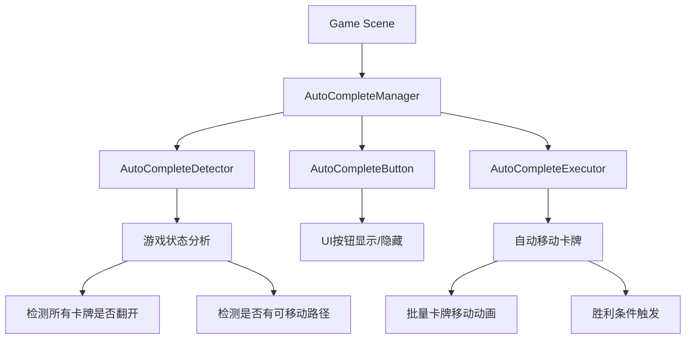
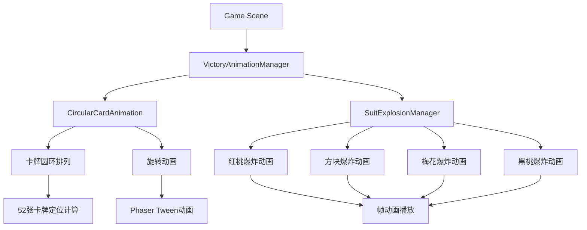

# 纸牌游戏完整版技术实现方案

## 1. 项目概述

### 1.1 项目背景和目标

本项目基于现有的Phaser 3 + TypeScript纸牌游戏，需要进行重大功能升级，主要目标包括：

- **移除教学系统**：完全禁用现有的教学引导功能，提供纯净的游戏体验
- **新增AutoComplete功能**：实现智能自动完成按钮，当游戏可自动完成时提供快速完成选项
- **华丽完成动画**：实现游戏胜利时的圆环卡牌动画和四种花色的爆炸特效
- **美术资源升级**：使用新的Dylan物料包，提升游戏视觉效果

### 1.2 主要变更点总结

| 变更类型 | 具体内容 | 影响范围 |
|---------|---------|---------|
| 功能移除 | 教学系统完全禁用 | TutorialManager, GuideSystem, TutorialSteps等 |
| 功能新增 | AutoComplete自动完成 | 新增AutoCompleteManager和相关UI |
| 动画升级 | 胜利动画系统 | 新增VictoryAnimationManager |
| 资源更新 | Dylan物料包集成 | 资源加载、AssetKeys更新 |

## 2. 技术架构设计

### 2.1 现有架构的保留和修改部分

#### 2.1.1 保留的核心架构
```typescript
// 保留的核心组件
src/game/scenes/Game.ts           // 主游戏场景（需修改）
src/game/components/Card.ts       // 卡牌组件（需修改）
src/game/animations/              // 动画系统（需扩展）
src/game/EventBus.ts             // 事件系统（保留）
src/config/klondike-layout.ts    // 布局配置（保留）
```

#### 2.1.2 需要修改的架构部分
```typescript
// 教学系统 - 完全禁用
src/game/tutorial/               // 整个目录标记为废弃
src/game/scenes/Game.ts          // 移除教学相关初始化

// 游戏逻辑 - 扩展
src/game/scenes/Game.ts          // 新增AutoComplete检测
src/game/components/             // 新增AutoComplete按钮组件
```

### 2.2 新增组件的架构设计

#### 2.2.1 AutoComplete系统架构


#### 2.2.2 胜利动画系统架构


### 2.3 模块间的依赖关系

```typescript
// 新的依赖关系图
Game Scene
├── AutoCompleteManager
│   ├── AutoCompleteDetector
│   ├── AutoCompleteButton
│   └── AutoCompleteExecutor
├── VictoryAnimationManager
│   ├── CircularCardAnimation
│   └── SuitExplosionManager
├── Card Components (现有)
├── EventBus (现有)
└── Layout System (现有)
```

## 3. 详细实现方案

### 3.1 教学系统禁用方案

#### 3.1.1 禁用策略
采用**软禁用**策略，保留代码但完全停止功能：

```typescript
// src/game/scenes/Game.ts 修改
class Game extends Scene {
    private tutorialManager: TutorialManager | null = null; // 设为null
    
    private initializeTutorial(): void {
        // 完全注释掉教学初始化
        // this.tutorialManager = new TutorialManager(this);
        console.log('🚫 Tutorial system disabled');
    }
}
```

#### 3.1.2 配置控制
```typescript
// src/config/game-config.ts (新增)
export const GameConfig = {
    TUTORIAL_ENABLED: false,  // 全局教学开关
    AUTO_COMPLETE_ENABLED: true,
    VICTORY_ANIMATION_ENABLED: true
};
```

#### 3.1.3 事件清理
```typescript
// 移除所有教学相关事件监听
// EventBus.on('card-moved', this.tutorialManager.onCardMoved, this);
// EventBus.on('card-to-foundation', this.tutorialManager.onCardToFoundation, this);
```

### 3.2 AutoComplete功能实现

#### 3.2.1 AutoCompleteManager设计
```typescript
// src/game/managers/AutoCompleteManager.ts (新增)
export class AutoCompleteManager {
    private scene: Game;
    private detector: AutoCompleteDetector;
    private button: AutoCompleteButton;
    private executor: AutoCompleteExecutor;
    private isEnabled: boolean = false;

    constructor(scene: Game) {
        this.scene = scene;
        this.detector = new AutoCompleteDetector(scene);
        this.button = new AutoCompleteButton(scene);
        this.executor = new AutoCompleteExecutor(scene);
        
        this.setupEventListeners();
    }

    public checkAutoCompleteCondition(): void {
        const canAutoComplete = this.detector.canAutoComplete();
        
        if (canAutoComplete && !this.isEnabled) {
            this.showAutoCompleteButton();
        } else if (!canAutoComplete && this.isEnabled) {
            this.hideAutoCompleteButton();
        }
    }

    private showAutoCompleteButton(): void {
        this.isEnabled = true;
        this.button.show();
        // 显示引导手指
        this.button.showGuideHand();
    }

    private hideAutoCompleteButton(): void {
        this.isEnabled = false;
        this.button.hide();
    }

    public executeAutoComplete(): void {
        if (!this.isEnabled) return;
        
        this.hideAutoCompleteButton();
        this.executor.execute();
    }
}
```

#### 3.2.2 AutoCompleteDetector设计
```typescript
// src/game/detectors/AutoCompleteDetector.ts (新增)
export class AutoCompleteDetector {
    private scene: Game;

    constructor(scene: Game) {
        this.scene = scene;
    }

    public canAutoComplete(): boolean {
        // 检测条件1：所有卡牌都已翻开
        if (!this.areAllCardsFaceUp()) {
            return false;
        }

        // 检测条件2：存在明确的移动路径到胜利
        return this.hasWinningPath();
    }

    private areAllCardsFaceUp(): boolean {
        // 检查tableau中的所有卡牌
        for (const column of this.scene.tableau) {
            for (const card of column.cards) {
                if (!card.faceUp) {
                    return false;
                }
            }
        }

        // 检查waste pile中的卡牌
        for (const card of this.scene.waste.cards) {
            if (!card.faceUp) {
                return false;
            }
        }

        return true;
    }

    private hasWinningPath(): boolean {
        // 使用深度优先搜索算法检测是否存在胜利路径
        const gameState = this.captureGameState();
        return this.dfsWinningPath(gameState, 0, 100); // 最大深度100
    }

    private captureGameState(): GameState {
        // 捕获当前游戏状态的快照
        return {
            tableau: this.cloneTableau(),
            foundation: this.cloneFoundation(),
            waste: this.cloneWaste(),
            stock: this.cloneStock()
        };
    }

    private dfsWinningPath(state: GameState, depth: number, maxDepth: number): boolean {
        if (depth > maxDepth) return false;
        
        // 检查是否已经胜利
        if (this.isWinningState(state)) {
            return true;
        }

        // 获取所有可能的移动
        const possibleMoves = this.getAllPossibleMoves(state);
        
        for (const move of possibleMoves) {
            const newState = this.applyMove(state, move);
            if (this.dfsWinningPath(newState, depth + 1, maxDepth)) {
                return true;
            }
        }

        return false;
    }
}
```

#### 3.2.3 AutoCompleteButton设计
```typescript
// src/game/components/AutoCompleteButton.ts (新增)
export class AutoCompleteButton {
    private scene: Game;
    private container: Phaser.GameObjects.Container;
    private button: Phaser.GameObjects.Image;
    private guideHand: Phaser.GameObjects.Image;
    private isVisible: boolean = false;

    constructor(scene: Game) {
        this.scene = scene;
        this.createButton();
    }

    private createButton(): void {
        this.container = this.scene.add.container(0, 0);
        
        // 创建AutoComplete按钮
        this.button = this.scene.add.image(0, 0, 'auto-complete-button');
        this.button.setInteractive();
        this.button.on('pointerdown', this.onButtonClick, this);
        
        // 创建引导手指
        this.guideHand = this.scene.add.image(20, -20, 'guide-hand');
        this.guideHand.setVisible(false);
        
        this.container.add([this.button, this.guideHand]);
        this.container.setVisible(false);
        
        // 设置按钮位置（根据布局配置）
        this.updatePosition();
    }

    public show(): void {
        if (this.isVisible) return;
        
        this.isVisible = true;
        this.container.setVisible(true);
        
        // 淡入动画
        this.container.setAlpha(0);
        this.scene.tweens.add({
            targets: this.container,
            alpha: 1,
            duration: 500,
            ease: 'Power2',
            onComplete: () => {
                this.startPulseAnimation();
            }
        });
    }

    public hide(): void {
        if (!this.isVisible) return;
        
        this.isVisible = false;
        this.stopAllAnimations();
        
        // 淡出动画
        this.scene.tweens.add({
            targets: this.container,
            alpha: 0,
            duration: 300,
            ease: 'Power2',
            onComplete: () => {
                this.container.setVisible(false);
            }
        });
    }

    public showGuideHand(): void {
        this.guideHand.setVisible(true);
        this.startHandAnimation();
    }

    private startPulseAnimation(): void {
        // 按钮跳动动画，500ms循环
        this.scene.tweens.add({
            targets: this.button,
            scaleX: 1.1,
            scaleY: 1.1,
            duration: 250,
            ease: 'Power2',
            yoyo: true,
            repeat: -1
        });
    }

    private startHandAnimation(): void {
        // 手指缩放动画，80%-120%
        this.scene.tweens.add({
            targets: this.guideHand,
            scaleX: 1.2,
            scaleY: 1.2,
            duration: 1000,
            ease: 'Power2',
            yoyo: true,
            repeat: -1
        });
    }

    private onButtonClick(): void {
        // 触发AutoComplete执行
        EventBus.emit('auto-complete-clicked');
    }

    private updatePosition(): void {
        // 根据当前布局更新按钮位置
        const layout = this.scene.currentLayout;
        // 位置计算逻辑...
    }
}
```

### 3.3 完成动画系统设计

#### 3.3.1 VictoryAnimationManager设计
```typescript
// src/game/animations/VictoryAnimationManager.ts (新增)
export class VictoryAnimationManager {
    private scene: Game;
    private circularAnimation: CircularCardAnimation;
    private explosionManager: SuitExplosionManager;
    private isPlaying: boolean = false;

    constructor(scene: Game) {
        this.scene = scene;
        this.circularAnimation = new CircularCardAnimation(scene);
        this.explosionManager = new SuitExplosionManager(scene);
    }

    public async playVictoryAnimation(): Promise<void> {
        if (this.isPlaying) return;
        
        this.isPlaying = true;
        
        try {
            // 第一阶段：圆环卡牌动画
            await this.circularAnimation.play();
            
            // 第二阶段：花色爆炸动画
            await this.explosionManager.playAllExplosions();
            
            // 第三阶段：显示胜利面板
            this.showVictoryPanel();
            
        } finally {
            this.isPlaying = false;
        }
    }

    private showVictoryPanel(): void {
        // 显示游戏结束面板
        EventBus.emit('show-victory-panel');
    }
}
```

#### 3.3.2 CircularCardAnimation设计
```typescript
// src/game/animations/CircularCardAnimation.ts (新增)
export class CircularCardAnimation {
    private scene: Game;
    private animationCards: Phaser.GameObjects.Image[] = [];
    private centerX: number;
    private centerY: number;
    private radius: number = 300;

    constructor(scene: Game) {
        this.scene = scene;
        this.calculateCenter();
    }

    public async play(): Promise<void> {
        // 收集所有卡牌
        this.collectAllCards();
        
        // 创建动画卡牌副本
        this.createAnimationCards();
        
        // 执行圆环排列动画
        await this.arrangeInCircle();
        
        // 执行旋转动画
        await this.rotateCards();
        
        // 清理动画卡牌
        this.cleanup();
    }

    private collectAllCards(): CardComponent[] {
        const allCards: CardComponent[] = [];
        
        // 从foundation收集卡牌
        for (const pile of this.scene.foundation) {
            allCards.push(...pile.cards);
        }
        
        return allCards;
    }

    private createAnimationCards(): void {
        const allCards = this.collectAllCards();
        
        allCards.forEach((card, index) => {
            // 创建卡牌的视觉副本
            const animCard = this.scene.add.image(card.x, card.y, 'card-front');
            animCard.setTexture(card.texture.key);
            animCard.setDepth(1000 + index);
            
            this.animationCards.push(animCard);
            
            // 隐藏原始卡牌
            card.setVisible(false);
        });
    }

    private async arrangeInCircle(): Promise<void> {
        const cardCount = this.animationCards.length;
        const angleStep = (Math.PI * 2) / cardCount;
        
        const promises = this.animationCards.map((card, index) => {
            const angle = index * angleStep;
            const targetX = this.centerX + Math.cos(angle) * this.radius;
            const targetY = this.centerY + Math.sin(angle) * this.radius;
            
            return new Promise<void>((resolve) => {
                this.scene.tweens.add({
                    targets: card,
                    x: targetX,
                    y: targetY,
                    duration: 1000,
                    ease: 'Power2',
                    delay: index * 50, // 错开动画
                    onComplete: resolve
                });
            });
        });
        
        await Promise.all(promises);
    }

    private async rotateCards(): Promise<void> {
        return new Promise<void>((resolve) => {
            // 整体旋转动画
            this.scene.tweens.add({
                targets: this.animationCards,
                angle: 360,
                duration: 2000,
                ease: 'Power2',
                onComplete: resolve
            });
        });
    }

    private cleanup(): void {
        this.animationCards.forEach(card => card.destroy());
        this.animationCards = [];
    }

    private calculateCenter(): void {
        this.centerX = this.scene.cameras.main.centerX;
        this.centerY = this.scene.cameras.main.centerY;
    }
}
```

#### 3.3.3 SuitExplosionManager设计
```typescript
// src/game/animations/SuitExplosionManager.ts (新增)
export class SuitExplosionManager {
    private scene: Game;
    private explosionSprites: Map<string, Phaser.GameObjects.Sprite> = new Map();

    constructor(scene: Game) {
        this.scene = scene;
        this.createExplosionSprites();
    }

    private createExplosionSprites(): void {
        const suits = ['hearts', 'diamonds', 'clubs', 'spades'];
        
        suits.forEach(suit => {
            const sprite = this.scene.add.sprite(0, 0, `explosion-${suit}`);
            sprite.setVisible(false);
            sprite.setDepth(2000);
            this.explosionSprites.set(suit, sprite);
        });
    }

    public async playAllExplosions(): Promise<void> {
        const explosionPromises = Array.from(this.explosionSprites.entries()).map(
            ([suit, sprite], index) => {
                return new Promise<void>((resolve) => {
                    setTimeout(() => {
                        this.playExplosion(suit, sprite).then(resolve);
                    }, index * 500); // 每个花色间隔500ms
                });
            }
        );
        
        await Promise.all(explosionPromises);
    }

    private async playExplosion(suit: string, sprite: Phaser.GameObjects.Sprite): Promise<void> {
        // 设置爆炸位置（对应foundation位置）
        const foundationIndex = this.getSuitFoundationIndex(suit);
        const position = this.getFoundationPosition(foundationIndex);
        
        sprite.setPosition(position.x, position.y);
        sprite.setVisible(true);
        
        return new Promise<void>((resolve) => {
            // 播放帧动画
            sprite.play(`explosion-${suit}-anim`);
            
            sprite.on('animationcomplete', () => {
                sprite.setVisible(false);
                resolve();
            });
        });
    }

    private getSuitFoundationIndex(suit: string): number {
        const suitMap = {
            'hearts': 0,
            'diamonds': 1,
            'clubs': 2,
            'spades': 3
        };
        return suitMap[suit] || 0;
    }

    private getFoundationPosition(index: number): { x: number, y: number } {
        const layout = this.scene.currentLayout;
        return {
            x: layout.foundation.startX + index * layout.foundation.gap,
            y: layout.foundation.startY
        };
    }
}
```

### 3.4 资源管理和替换策略

#### 3.4.1 资源映射表
```typescript
// src/assets/DylanAssets.ts (新增)
export const DylanAssets = {
    // 背景资源
    backgrounds: {
        portrait: 'docs/250805完整游戏语言自适应/物料-Dylan/图片/bg-竖.png',
        landscape: 'docs/250805完整游戏语言自适应/物料-Dylan/图片/bg-横.png'
    },
    
    // 按钮资源
    buttons: {
        autoComplete: 'docs/250805完整游戏语言自适应/物料-Dylan/图片/button/AutoComplete.png',
        again: 'docs/250805完整游戏语言自适应/物料-Dylan/图片/button/again.png',
        playNow: 'docs/250805完整游戏语言自适应/物料-Dylan/图片/button/play now.png'
    },
    
    // 卡牌资源
    cards: {
        back: 'docs/250805完整游戏语言自适应/物料-Dylan/图片/扑克牌/卡背.png',
        front: 'docs/250805完整游戏语言自适应/物料-Dylan/图片/扑克牌/牌面.png',
        suits: {
            hearts: 'docs/250805完整游戏语言自适应/物料-Dylan/图片/扑克牌/花色/红桃.png',
            diamonds: 'docs/250805完整游戏语言自适应/物料-Dylan/图片/扑克牌/花色/方块.png',
            clubs: 'docs/250805完整游戏语言自适应/物料-Dylan/图片/扑克牌/花色/梅花.png',
            spades: 'docs/250805完整游戏语言自适应/物料-Dylan/图片/扑克牌/花色/黑桃.png'
        },
        values: {
            red: {
                A: 'docs/250805完整游戏语言自适应/物料-Dylan/图片/扑克牌/牌值/红数字/A.png',
                '2': 'docs/250805完整游戏语言自适应/物料-Dylan/图片/扑克牌/牌值/红数字/2.png',
                // ... 其他数字
            },
            black: {
                A: 'docs/250805完整游戏语言自适应/物料-Dylan/图片/扑克牌/牌值/黑数字/A.png',
                '2': 'docs/250805完整游戏语言自适应/物料-Dylan/图片/扑克牌/牌值/黑数字/2.png',
                // ... 其他数字
            }
        }
    },
    
    // 爆炸动画资源
    explosions: {
        hearts: Array.from({length: 16}, (_, i) => 
            `docs/250805完整游戏语言自适应/物料-Dylan/图片/花色爆炸/红桃/爆炸红桃粒子_${i.toString().padStart(5, '0')}.png`
        ),
        diamonds: Array.from({length: 16}, (_, i) => 
            `docs/250805完整游戏语言自适应/物料-Dylan/图片/花色爆炸/方块/爆炸方块粒子_${i.toString().padStart(5, '0')}.png`
        ),
        clubs: Array.from({length: 16}, (_, i) => 
            `docs/250805完整游戏语言自适应/物料-Dylan/图片/花色爆炸/梅花/爆炸梅花粒子_${i.toString().padStart(5, '0')}.png`
        ),
        spades: Array.from({length: 16}, (_, i) => 
            `docs/250805完整游戏语言自适应/物料-Dylan/图片/花色爆炸/黑桃/爆炸黑桃粒子_${i.toString().padStart(5, '0')}.png`
        )
    },
    
    // 音效资源
    audio: {
        bgm: 'docs/250805完整游戏语言自适应/物料-Dylan/音效/bgm.mp3',
        cardDeal: 'docs/250805完整游戏语言自适应/物料-Dylan/音效/发牌.mp3',
        cardFlip: 'docs/250805完整游戏语言自适应/物料-Dylan/音效/翻牌.mp3',
        cardPlace: 'docs/250805完整游戏语言自适应/物料-Dylan/音效/放入卡槽.mp3',
        victory: 'docs/250805完整游戏语言自适应/物料-Dylan/音效/胜利结算.mp3',
        error: 'docs/250805完整游戏语言自适应/物料-Dylan/音效/错误.mp3'
    },
    
    // UI元素
    ui: {
        hand: 'docs/250805完整游戏语言自适应/物料-Dylan/图片/手.png',
        icon: 'docs/250805完整游戏语言自适应/物料-Dylan/图片/icon.png',
        mask: 'docs/250805完整游戏语言自适应/物料-Dylan/图片/暗色蒙版.png'
    }
};
```

#### 3.4.2 资源加载策略
```typescript
// src/game/scenes/Preloader.ts 修改
export class Preloader extends Scene {
    preload() {
        // 加载Dylan资源包
        this.loadDylanAssets();
        
        // 创建爆炸动画
        this.createExplosionAnimations();
    }
    
    private loadDylanAssets(): void {
        // 加载背景
        this.load.image('bg-portrait', DylanAssets.backgrounds.portrait);
        this.load.image('bg-landscape', DylanAssets.backgrounds.landscape);
        
        // 加载按钮
        this.load.image('auto-complete-button', DylanAssets.buttons.autoComplete);
        this.load.image('again-button', DylanAssets.buttons.again);
        this.load.image('play-now-button', DylanAssets.buttons.playNow);
        
        // 加载卡牌资源
        this.load.image('card-back', DylanAssets.cards.back);
        this.load.image('card-front', DylanAssets.cards.front);
        
        // 加载花色
        Object.entries(DylanAssets.cards.suits).forEach(([suit, path]) => {
            this.load.image(`suit-${suit}`, path);
        });
        
        // 加载爆炸动画帧
        this.loadExplosionFrames();
        
        // 加载音效
        Object.entries(DylanAssets.audio).forEach(([key, path]) => {
            this.load.audio(key, path);
        });
    }
    
    private loadExplosionFrames(): void {
        Object.entries(DylanAssets.explosions).forEach(([suit, frames]) => {
            frames.forEach((framePath, index) => {
                this.load.image(`explosion-${suit}-${index}`, framePath);
            });
        });
    }
    
    private createExplosionAnimations(): void {
        const suits = ['hearts', 'diamonds', 'clubs', 'spades'];
        
        suits.forEach(suit => {
            const frames = Array.from({length: 16}, (_, i) => ({
                key: `explosion-${suit}-${i}`
            }));
            
            this.anims.create({
                key: `explosion-${suit}-anim`,
                frames: frames,
                frameRate: 24,
                repeat: 0
            });
        });
    }
}
```

## 4. 文件修改清单

### 4.1 需要修改的现有文件列表

| 文件路径 | 修改类型 | 主要修改内容 |
|---------|---------|-------------|
| `src/game/scenes/Game.ts` | 重大修改 | 移除教学初始化，新增AutoComplete管理器，新增胜利动画触发 |
| `src/game/scenes/Preloader.ts` | 重大修改 | 新增Dylan资源加载，创建爆炸动画 |
| `src/game/components/Card.ts` | 轻微修改 | 可能需要新增动画支持方法 |
| `src/assets/index.ts` | 重大修改 | 更新资源键值映射 |
| `src/config/klondike-layout.ts` | 轻微修改 | 可能需要新增AutoComplete按钮位置配置 |

### 4.2 需要新增的文件列表

| 文件路径 | 文件类型 | 功能描述 |
|---------|---------|---------|
| `src/game/managers/AutoCompleteManager.ts` | 核心类 | AutoComplete功能主管理器 |
| `src/game/detectors/AutoCompleteDetector.ts` | 算法类 | 自动完成条件检测器 |
| `src/game/components/AutoCompleteButton.ts` | UI组件 | 自动完成按钮组件 |
| `src/game/executors/AutoCompleteExecutor.ts` | 执行器 | 自动完成执行器 |
| `src/game/animations/VictoryAnimationManager.ts` | 动画管理器 | 胜利动画主管理器 |
| `src/game/animations/CircularCardAnimation.ts` | 动画类 | 圆环卡牌动画 |
| `src/game/animations/SuitExplosionManager.ts` | 动画管理器 | 花色爆炸动画管理器 |
| `src/assets/DylanAssets.ts` | 资源配置 | Dylan物料包资源映射 |
| `src/config/game-config.ts` | 配置文件 | 游戏功能开关配置 |
| `src/types/GameState.ts` | 类型定义 | 游戏状态类型定义 |
| `src/types/AutoComplete.ts` | 类型定义 | AutoComplete相关类型定义 |
| `src/utils/DeviceDetector.ts` | 工具类 | 设备性能检测 |
| `src/utils/BrowserCompatibility.ts` | 工具类 | 浏览器兼容性检测 |
| `src/utils/PerformanceMonitor.ts` | 工具类 | 性能监控 |

### 4.3 需要删除或重命名的文件

| 文件路径 | 操作类型 | 说明 |
|---------|---------|------|
| `src/game/tutorial/` | 标记废弃 | 整个教学系统目录，保留但不使用 |
| `src/assets/images/tutorial/` | 可删除 | 教学相关图片资源 |

## 5. 实施计划

### 5.1 分阶段实施策略

#### 第一阶段：基础架构准备（预计2-3天）
**目标**：建立新功能的基础架构，禁用教学系统

**主要任务**：
1. 创建新的配置文件和类型定义
2. 禁用教学系统
3. 建立AutoComplete基础架构
4. 建立胜利动画基础架构

**验收标准**：
- 游戏可正常运行，无教学功能
- 新的管理器类创建完成
- 基础配置文件就位

#### 第二阶段：AutoComplete功能实现（预计3-4天）
**目标**：完整实现AutoComplete功能

**主要任务**：
1. 实现AutoCompleteDetector算法
2. 创建AutoCompleteButton UI组件
3. 实现AutoCompleteExecutor
4. 集成到主游戏循环

**验收标准**：
- AutoComplete按钮在正确时机显示/隐藏
- 点击按钮能正确执行自动完成
- 自动完成逻辑准确无误

#### 第三阶段：胜利动画系统（预计4-5天）
**目标**：实现华丽的胜利动画效果

**主要任务**：
1. 实现圆环卡牌动画
2. 实现四种花色爆炸动画
3. 集成到胜利流程
4. 性能优化

**验收标准**：
- 圆环动画流畅自然
- 四种花色爆炸效果正确
- 动画性能良好，无卡顿

#### 第四阶段：资源更新和集成（预计2-3天）
**目标**：完成Dylan物料包的完整集成

**主要任务**：
1. 更新所有资源加载
2. 替换现有UI元素
3. 音效资源更新
4. 视觉效果调优

**验收标准**：
- 所有新资源正确加载
- 视觉效果符合设计要求
- 音效播放正常

#### 第五阶段：测试和优化（预计2-3天）
**目标**：全面测试和性能优化

**主要任务**：
1. 功能测试
2. 兼容性测试
3. 性能优化
4. Bug修复

**验收标准**：
- 所有功能正常工作
- 性能指标达标
- 无严重Bug

### 5.2 每个阶段的具体任务

#### 第一阶段详细任务
```
Day 1:
- 创建 src/config/game-config.ts
- 创建 src/types/ 下的类型定义文件
- 修改 src/game/scenes/Game.ts，禁用教学系统
- 创建 AutoCompleteManager 基础结构

Day 2:
- 创建 VictoryAnimationManager 基础结构
- 修改 src/game/scenes/Preloader.ts，准备新资源加载
- 创建 src/assets/DylanAssets.ts

Day 3:
- 集成测试基础架构
- 确保游戏基本功能正常
- 代码审查和调整
```

#### 第二阶段详细任务
```
Day 1:
- 实现 AutoCompleteDetector 核心算法
- 编写游戏状态检测逻辑

Day 2:
- 实现 AutoCompleteButton UI组件
- 添加按钮动画效果

Day 3:
- 实现 AutoCompleteExecutor
- 编写自动移动卡牌逻辑

Day 4:
- 集成到主游戏循环
- 功能测试和调试
```

#### 第三阶段详细任务
```
Day 1-2:
- 实现 CircularCardAnimation
- 卡牌圆环排列算法
- 旋转动画效果

Day 3-4:
- 实现 SuitExplosionManager
- 四种花色爆炸动画
- 帧动画播放逻辑

Day 5:
- 集成胜利动画到游戏流程
- 性能优化和测试
```

### 5.3 时间估算和里程碑

| 里程碑 | 预计完成时间 | 关键交付物 |
|--------|-------------|-----------|
| M1: 基础架构完成 | 第3天 | 教学系统禁用，新架构就位 |
| M2: AutoComplete功能完成 | 第7天 | AutoComplete功能完全可用 |
| M3: 胜利动画完成 | 第12天 | 胜利动画效果完整 |
| M4: 资源集成完成 | 第15天 | Dylan物料包完全集成 |
| M5: 项目完成 | 第18天 | 所有功能测试通过，项目交付 |

## 6. 风险评估和应对策略

### 6.1 技术风险点识别

#### 高风险项
1. **AutoComplete算法复杂度**
   - **风险描述**：深度优先搜索可能导致性能问题
   - **影响程度**：高
   - **应对策略**：
     - 设置合理的搜索深度限制（100步）
     - 实现启发式剪枝算法
     - 添加超时机制
     - 考虑使用Web Worker进行后台计算

2. **胜利动画性能**
   - **风险描述**：52张卡牌同时动画可能造成性能问题
   - **影响程度**：中高
   - **应对策略**：
     - 使用对象池管理动画对象
     - 分批执行动画，避免同时创建过多对象
     - 在低端设备上降低动画质量
     - 提供动画开关选项

#### 中风险项
3. **资源加载时间**
   - **风险描述**：新增大量图片资源可能影响加载速度
   - **影响程度**：中
   - **应对策略**：
     - 压缩图片资源
     - 实现渐进式加载
     - 添加加载进度提示
     - 考虑使用WebP格式

4. **兼容性问题**
   - **风险描述**：新功能在不同设备上的兼容性
   - **影响程度**：中
   - **应对策略**：
     - 在多种设备上测试
     - 提供降级方案
     - 使用Phaser的兼容性API

#### 低风险项
5. **教学系统禁用影响**
   - **风险描述**：禁用教学系统可能影响其他功能
   - **影响程度**：低
   - **应对策略**：
     - 采用软禁用策略
     - 保留代码结构
     - 充分测试相关功能

### 6.2 兼容性考虑

#### 设备兼容性
```typescript
// src/utils/DeviceDetector.ts (新增)
export class DeviceDetector {
    public static isLowEndDevice(): boolean {
        // 检测设备性能
        const canvas = document.createElement('canvas');
        const gl = canvas.getContext('webgl');
        
        if (!gl) return true;
        
        const debugInfo = gl.getExtension('WEBGL_debug_renderer_info');
        if (debugInfo) {
            const renderer = gl.getParameter(debugInfo.UNMASKED_RENDERER_WEBGL);
            // 根据GPU信息判断设备性能
            return this.isLowEndGPU(renderer);
        }
        
        return false;
    }
    
    public static getOptimalAnimationSettings(): AnimationSettings {
        if (this.isLowEndDevice()) {
            return {
                explosionQuality: 'low',
                circularAnimationDuration: 1500,
                maxConcurrentAnimations: 10
            };
        }
        
        return {
            explosionQuality: 'high',
            circularAnimationDuration: 2000,
            maxConcurrentAnimations: 52
        };
    }
}
```

#### 浏览器兼容性
```typescript
// src/utils/BrowserCompatibility.ts (新增)
export class BrowserCompatibility {
    public static checkWebGLSupport(): boolean {
        try {
            const canvas = document.createElement('canvas');
            return !!(window.WebGLRenderingContext &&
                     canvas.getContext('webgl'));
        } catch (e) {
            return false;
        }
    }
    
    public static checkAudioSupport(): boolean {
        const audio = document.createElement('audio');
        return !!(audio.canPlayType && audio.canPlayType('audio/mpeg'));
    }
    
    public static getCompatibilitySettings(): CompatibilitySettings {
        return {
            webglSupported: this.checkWebGLSupport(),
            audioSupported: this.checkAudioSupport(),
            touchSupported: 'ontouchstart' in window,
            animationSupported: 'requestAnimationFrame' in window
        };
    }
}
```

### 6.3 性能影响评估

#### 内存使用评估
| 组件 | 预估内存占用 | 优化策略 |
|------|-------------|---------|
| 爆炸动画帧 | ~8MB (64帧×4花色×32KB) | 使用压缩纹理，按需加载 |
| 圆环动画卡牌 | ~2MB (52张卡牌副本) | 使用对象池，及时回收 |
| AutoComplete算法 | ~1MB (游戏状态缓存) | 限制搜索深度，及时清理 |

#### CPU性能评估
| 功能 | 性能影响 | 优化措施 |
|------|---------|---------|
| AutoComplete检测 | 中等 | 异步执行，分帧计算 |
| 圆环动画 | 低 | 使用GPU加速的Tween |
| 爆炸动画 | 中等 | 限制同时播放数量 |

#### 加载时间评估
```typescript
// 预估加载时间分析
const LoadingTimeEstimate = {
    dylanAssets: {
        images: '~15MB, 预计3-5秒',
        audio: '~5MB, 预计1-2秒',
        total: '~20MB, 预计4-7秒'
    },
    optimizations: [
        '图片压缩可减少30-50%体积',
        '渐进式加载可改善用户体验',
        'WebP格式可减少20-30%体积'
    ]
};
```

## 7. 测试策略

### 7.1 功能测试要点

#### AutoComplete功能测试
```typescript
// src/tests/AutoCompleteTest.ts (新增)
export class AutoCompleteTest {
    public static testDetectionAccuracy(): TestResult[] {
        const testCases = [
            {
                name: '所有卡牌翻开且有胜利路径',
                gameState: this.createWinnableState(),
                expected: true
            },
            {
                name: '存在背面卡牌',
                gameState: this.createStateWithHiddenCards(),
                expected: false
            },
            {
                name: '无胜利路径',
                gameState: this.createUnwinnableState(),
                expected: false
            }
        ];
        
        return testCases.map(testCase => ({
            name: testCase.name,
            passed: AutoCompleteDetector.canAutoComplete(testCase.gameState) === testCase.expected
        }));
    }
    
    public static testExecutionCorrectness(): TestResult[] {
        // 测试自动执行的正确性
        const testGame = this.createTestGame();
        const executor = new AutoCompleteExecutor(testGame);
        
        const initialState = this.captureGameState(testGame);
        executor.execute();
        const finalState = this.captureGameState(testGame);
        
        return [{
            name: '自动完成执行正确性',
            passed: this.isWinningState(finalState)
        }];
    }
}
```

#### 胜利动画测试
```typescript
// src/tests/VictoryAnimationTest.ts (新增)
export class VictoryAnimationTest {
    public static testCircularAnimation(): TestResult[] {
        return [
            {
                name: '圆环排列计算正确性',
                test: () => this.testCircularPositioning()
            },
            {
                name: '动画流畅性',
                test: () => this.testAnimationSmoothness()
            },
            {
                name: '内存泄漏检测',
                test: () => this.testMemoryLeaks()
            }
        ];
    }
    
    public static testExplosionAnimations(): TestResult[] {
        return [
            {
                name: '四种花色爆炸正确播放',
                test: () => this.testAllSuitExplosions()
            },
            {
                name: '帧动画同步性',
                test: () => this.testFrameSync()
            },
            {
                name: '性能影响测试',
                test: () => this.testPerformanceImpact()
            }
        ];
    }
}
```

### 7.2 兼容性测试范围

#### 设备测试矩阵
| 设备类型 | 测试重点 | 预期结果 |
|---------|---------|---------|
| 高端手机 | 完整功能，最佳画质 | 所有动画流畅，60FPS |
| 中端手机 | 功能完整，画质适中 | 动画流畅，45-60FPS |
| 低端手机 | 基础功能，降级画质 | 基本流畅，30-45FPS |
| 平板设备 | 布局适配，触控优化 | 界面适配良好 |
| 桌面浏览器 | 鼠标交互，键盘支持 | 交互体验良好 |

#### 浏览器测试范围
```typescript
const BrowserTestMatrix = {
    mobile: [
        'Chrome Mobile 90+',
        'Safari Mobile 14+',
        'Firefox Mobile 88+',
        'Samsung Internet 14+'
    ],
    desktop: [
        'Chrome 90+',
        'Firefox 88+',
        'Safari 14+',
        'Edge 90+'
    ],
    testPoints: [
        'WebGL支持',
        '音频播放',
        '触控事件',
        '性能表现',
        '内存使用'
    ]
};
```

### 7.3 性能测试指标

#### 关键性能指标(KPI)
```typescript
export interface PerformanceKPI {
    // 加载性能
    initialLoadTime: number;      // 目标: <5秒
    assetLoadTime: number;        // 目标: <3秒
    
    // 运行时性能
    averageFPS: number;           // 目标: >45FPS
    memoryUsage: number;          // 目标: <100MB
    
    // 动画性能
    animationFPS: number;         // 目标: >30FPS
    animationDropFrames: number;  // 目标: <5%
    
    // 交互响应
    inputLatency: number;         // 目标: <100ms
    autoCompleteTime: number;     // 目标: <2秒
}
```

#### 性能监控实现
```typescript
// src/utils/PerformanceMonitor.ts (新增)
export class PerformanceMonitor {
    private metrics: PerformanceKPI = {
        initialLoadTime: 0,
        assetLoadTime: 0,
        averageFPS: 0,
        memoryUsage: 0,
        animationFPS: 0,
        animationDropFrames: 0,
        inputLatency: 0,
        autoCompleteTime: 0
    };
    
    public startMonitoring(): void {
        this.monitorFPS();
        this.monitorMemory();
        this.monitorInputLatency();
    }
    
    private monitorFPS(): void {
        let lastTime = performance.now();
        let frameCount = 0;
        
        const measureFPS = (currentTime: number) => {
            frameCount++;
            
            if (currentTime - lastTime >= 1000) {
                this.metrics.averageFPS = frameCount;
                frameCount = 0;
                lastTime = currentTime;
            }
            
            requestAnimationFrame(measureFPS);
        };
        
        requestAnimationFrame(measureFPS);
    }
    
    private monitorMemory(): void {
        if ('memory' in performance) {
            setInterval(() => {
                this.metrics.memoryUsage = (performance as any).memory.usedJSHeapSize / 1024 / 1024;
            }, 5000);
        }
    }
    
    public getMetrics(): PerformanceKPI {
        return { ...this.metrics };
    }
    
    public reportPerformance(): void {
        console.log('🔍 Performance Metrics:', this.metrics);
        
        // 发送到分析服务
        if (this.shouldReport()) {
            this.sendToAnalytics(this.metrics);
        }
    }
}
```

### 7.4 自动化测试策略

#### 单元测试覆盖
```typescript
// jest.config.js 配置
module.exports = {
    testEnvironment: 'jsdom',
    setupFilesAfterEnv: ['<rootDir>/src/tests/setup.ts'],
    collectCoverageFrom: [
        'src/game/managers/**/*.ts',
        'src/game/detectors/**/*.ts',
        'src/game/executors/**/*.ts',
        'src/game/animations/**/*.ts',
        '!src/game/tutorial/**/*.ts' // 排除废弃的教学系统
    ],
    coverageThreshold: {
        global: {
            branches: 80,
            functions: 80,
            lines: 80,
            statements: 80
        }
    }
};
```

#### 集成测试方案
```typescript
// src/tests/integration/GameFlowTest.ts
export class GameFlowTest {
    public static async testCompleteGameFlow(): Promise<void> {
        // 1. 游戏初始化
        const game = new TestGameScene();
        await game.initialize();
        
        // 2. 禁用教学系统验证
        expect(game.tutorialManager).toBeNull();
        
        // 3. AutoComplete功能验证
        const autoCompleteManager = game.autoCompleteManager;
        expect(autoCompleteManager).toBeDefined();
        
        // 4. 模拟游戏进行到可自动完成状态
        await this.simulateGameToAutoCompleteState(game);
        
        // 5. 验证AutoComplete按钮显示
        expect(autoCompleteManager.isButtonVisible()).toBe(true);
        
        // 6. 执行自动完成
        await autoCompleteManager.executeAutoComplete();
        
        // 7. 验证胜利动画触发
        expect(game.victoryAnimationManager.isPlaying()).toBe(true);
        
        // 8. 等待动画完成
        await this.waitForAnimationComplete(game);
        
        // 9. 验证游戏结束状态
        expect(game.isGameWon()).toBe(true);
    }
}
```

## 8. 总结

### 8.1 技术方案总结

本技术实现方案为纸牌游戏完整版提供了全面的升级路径：

1. **教学系统禁用**：采用软禁用策略，保持代码结构完整性的同时完全停止教学功能
2. **AutoComplete功能**：基于深度优先搜索算法的智能检测，提供流畅的自动完成体验
3. **胜利动画系统**：华丽的圆环卡牌动画配合四种花色爆炸特效，提升游戏完成时的成就感
4. **资源升级**：完整集成Dylan物料包，提升游戏整体视觉品质

### 8.2 关键技术亮点

- **智能算法**：AutoComplete检测算法能准确判断游戏状态和胜利路径
- **性能优化**：多层次的性能优化策略，确保在各种设备上的流畅运行
- **兼容性保障**：全面的兼容性测试和降级方案
- **可维护性**：清晰的架构设计和完整的测试覆盖

### 8.3 预期效果

- **用户体验提升**：移除教学干扰，提供纯净游戏体验
- **游戏完成度**：AutoComplete功能降低游戏难度，提高完成率
- **视觉效果**：华丽的胜利动画增强游戏的娱乐性和成就感
- **技术先进性**：现代化的技术架构为后续功能扩展奠定基础

### 8.4 后续扩展建议

1. **AI辅助功能**：基于AutoComplete算法扩展提示系统
2. **多样化动画**：增加更多胜利动画变体
3. **个性化设置**：允许用户自定义动画效果和游戏设置
4. **数据分析**：收集用户行为数据，优化游戏体验

---

**文档版本**: v1.0
**创建日期**: 2025-01-14
**最后更新**: 2025-01-14
**状态**: ✅ 已完成

本文档为开发团队提供了详细的技术实现指导，确保项目能够高质量、高效率地完成升级目标。