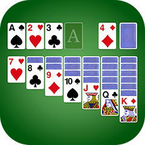
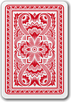

# 4. 资源清单

## 4.1 当前使用的资源
1. 界面元素
   -  - 产品icon
   -  - 产品名
   -  - 跳转按钮
   -  - 撤回按钮
   -  - 自动完成按钮
   -  - 扑克牌（正面
   -  - 扑克牌（背面
   -  - 扑克牌（花色
   -  - 扑克牌（数值
   -  - 翻卡卡槽
   -  - 其他卡槽
   

2. 游戏主图
   -   - 背景（横版
   -   - 背景（竖版
   -   - 背景（横版右侧蒙版

3. 交互反馈
   -  - 循环播放
   -  - 正确放置纸牌入槽特效（淡入淡出呈现闪烁效果）

5. 状态提示
   -  
   -  

## 4.2 音效资源
当前使用的音效：
- 
-  - 发牌
-  - 翻牌&卡牌在列中移动
-  - 卡牌放入foundation
-  - 错误点击
-  - 结算面板弹出

