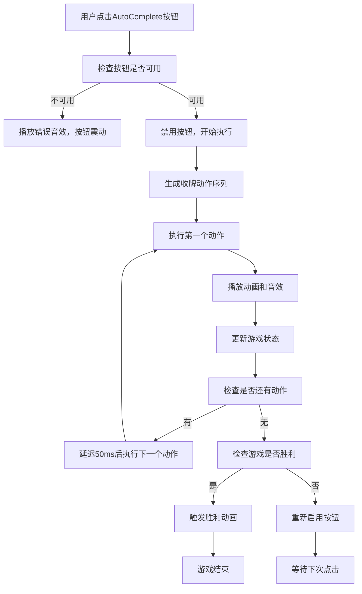

# AutoComplete自动收牌功能设计文档

## 文档概述

本文档详细描述了纸牌接龙游戏中AutoComplete自动收牌功能的设计规范，包括功能概述、UI设计、算法逻辑、动画效果、技术实现方案等各个方面。

---

## 1. 功能概述

### 1.1 AutoComplete功能的目标和作用

AutoComplete自动收牌功能旨在为玩家提供便捷的游戏体验，当游戏进入可自动完成状态时，系统能够：

- **智能检测**：自动识别当前游戏状态是否可以通过确定性操作完成
- **一键收牌**：玩家点击AutoComplete按钮后，系统自动执行所有剩余的收牌操作
- **视觉反馈**：提供流畅的动画效果和音效反馈，增强游戏体验
- **节省时间**：避免玩家进行重复性的机械操作，快速完成游戏

### 1.2 与现有游戏逻辑的关系

AutoComplete功能与现有系统的集成关系：

- **依赖现有收牌逻辑**：复用[`Game.addToFoundation()`](src/game/scenes/Game.ts:1380)方法
- **集成动画系统**：利用现有的[`SuitExplosionManager`](src/game/animations/SuitExplosionManager.ts:1)花色爆炸动画
- **遵循游戏规则**：严格按照Klondike Solitaire的收牌规则执行
- **保持状态一致性**：确保分数、移动次数等游戏状态正确更新

---

## 2. UI设计规范

### 2.1 AutoComplete按钮的位置、样式、状态

#### 2.1.1 按钮位置
- **替换位置**：覆盖当前下载按钮的位置（[`this.currentLayout.downloadButton`](src/config/klondike-layout.ts:1)）
- **坐标获取**：使用现有的[`updatePlayNowButtonPosition()`](src/game/scenes/Game.ts:791)方法的位置逻辑
- **深度层级**：设置为与下载按钮相同的深度，确保正确显示

#### 2.1.2 按钮样式
```typescript
// 按钮资源配置
const AUTOCOMPLETE_BUTTON_CONFIG = {
    texture: AssetKeys.AUTO_COMPLETE_BUTTON, // 使用现有资源键名
    scale: 0.8, // 与下载按钮保持一致的缩放
    interactive: true,
    depth: 100 // 确保在游戏元素之上
};
```

#### 2.1.3 按钮状态
- **显示状态**：始终显示，不根据游戏状态隐藏
- **可用状态**：根据自动完成检测结果启用/禁用
- **视觉反馈**：
  - 可用时：正常显示 + 缩放动画
  - 不可用时：半透明显示（alpha: 0.5）
  - 点击时：缩放反馈动画

### 2.2 按钮的显示/隐藏条件

```typescript
// 按钮显示逻辑
interface AutoCompleteButtonState {
    visible: boolean;    // 始终为true
    enabled: boolean;    // 根据检测结果动态变化
    alpha: number;       // 0.5（禁用）或 1.0（启用）
}
```

**显示条件**：
- ✅ 游戏开始后始终显示
- ✅ 教学模式下也显示（但可能禁用）
- ✅ 游戏胜利前始终可见

**启用条件**：
- ✅ 所有卡牌都已翻开（正面朝上）
- ✅ 存在明确的收牌路径到胜利状态
- ❌ 游戏已胜利时禁用

### 2.3 与现有UI的集成方式

#### 2.3.1 集成到现有UI创建流程
```typescript
// 在Game.ts的createUI()方法中添加
private createUI(): void {
    this.createZones();
    this.createScoreboard();
    this.createAutoCompleteButton(); // 新增
    this.createVendorInfo();
}
```

#### 2.3.2 响应式布局适配
- **横屏适配**：使用[`landscapeLayout.downloadButton`](src/config/klondike-layout.ts:1)位置
- **竖屏适配**：使用[`portraitLayout.downloadButton`](src/config/klondike-layout.ts:1)位置
- **尺寸调整**：跟随现有按钮的缩放逻辑

---

## 3. 自动收牌逻辑设计

### 3.1 收牌条件判断算法

#### 3.1.1 基础检测条件
```typescript
interface AutoCompleteConditions {
    allCardsFaceUp: boolean;      // 所有卡牌都已翻开
    hasWinningPath: boolean;      // 存在胜利路径
    noBlockedCards: boolean;      // 没有被阻挡的卡牌
}
```

#### 3.1.2 详细检测逻辑
```typescript
class AutoCompleteDetector {
    public canAutoComplete(): boolean {
        // 条件1：检查所有卡牌是否都已翻开
        if (!this.areAllCardsFaceUp()) {
            return false;
        }
        
        // 条件2：检查是否存在明确的移动路径
        if (!this.hasWinningPath()) {
            return false;
        }
        
        // 条件3：检查是否有足够的可移动卡牌
        return this.hasMovableCards();
    }
    
    private areAllCardsFaceUp(): boolean {
        // 检查tableau中的所有卡牌
        for (const column of this.scene.tableau) {
            for (const card of column.cards) {
                if (!card.faceUp) return false;
            }
        }
        
        // 检查waste pile中的卡牌
        for (const card of this.scene.waste.cards) {
            if (!card.faceUp) return false;
        }
        
        return true;
    }
}
```

### 3.2 花色轮转收牌顺序算法

#### 3.2.1 轮转策略
```typescript
interface SuitRotationStrategy {
    suits: CardSuit[];           // ['h', 'd', 'c', 's'] 固定顺序
    currentIndex: number;        // 当前轮转索引
    completedSuits: Set<CardSuit>; // 已完成的花色
}
```

#### 3.2.2 收牌顺序实现
```typescript
class CardCollectionSequencer {
    private suitOrder: CardSuit[] = ['h', 'd', 'c', 's']; // 红桃、方块、梅花、黑桃
    
    public generateCollectionSequence(): CardMoveAction[] {
        const actions: CardMoveAction[] = [];
        const completedSuits = new Set<CardSuit>();
        
        while (completedSuits.size < 4) {
            let foundCard = false;
            
            for (const suit of this.suitOrder) {
                if (completedSuits.has(suit)) continue;
                
                const nextCard = this.findNextCardForSuit(suit);
                if (nextCard) {
                    actions.push({
                        card: nextCard,
                        targetFoundation: this.getSuitFoundationIndex(suit),
                        delay: actions.length * 50 // 每个动作延迟50ms
                    });
                    foundCard = true;
                    
                    // 检查该花色是否完成（K已收集）
                    if (nextCard.numericValue === 13) {
                        completedSuits.add(suit);
                    }
                }
            }
            
            if (!foundCard) break; // 没有可收集的卡牌，退出循环
        }
        
        return actions;
    }
}
```

### 3.3 卡牌来源识别（卡牌区域 vs Stock区域）

#### 3.3.1 来源检测逻辑
```typescript
enum CardSource {
    TABLEAU = 'tableau',
    WASTE = 'waste',
    STOCK = 'stock'
}

interface CardLocation {
    source: CardSource;
    index?: number;        // tableau列索引
    needsFlip?: boolean;   // 是否需要从stock翻牌
}
```

#### 3.3.2 特殊处理：Stock区域卡牌
```typescript
class StockCardHandler {
    public async collectFromStock(card: CardComponent): Promise<void> {
        // 1. 先翻牌到waste区域
        await this.flipCardToWaste(card);
        
        // 2. 再从waste移动到foundation
        await this.moveFromWasteToFoundation(card);
    }
    
    private async flipCardToWaste(card: CardComponent): Promise<void> {
        // 复用现有的翻牌动画逻辑
        // 参考Game.ts中的playStockFlipAnimation()方法
        return this.scene.playStockFlipAnimation();
    }
}
```

---

## 4. 动画效果设计

### 4.1 卡牌飞行动画的路径和时间

#### 4.1.1 动画参数配置
```typescript
const ANIMATION_CONFIG = {
    // 飞行动画
    FLIGHT_DURATION: 300,        // 卡牌飞行时间（毫秒）
    FLIGHT_EASE: 'Power2.easeOut', // 缓动函数
    
    // 序列延迟
    SEQUENCE_DELAY: 50,          // 每个收牌动作间隔（毫秒）
    
    // 路径配置
    ARC_HEIGHT: 50,              // 飞行弧度高度
    ROTATION_ANGLE: 15,          // 飞行时的旋转角度
};
```

#### 4.1.2 飞行路径计算
```typescript
class CardFlightPath {
    public calculatePath(startPos: Point, endPos: Point): Point[] {
        const midPoint = {
            x: (startPos.x + endPos.x) / 2,
            y: Math.min(startPos.y, endPos.y) - ANIMATION_CONFIG.ARC_HEIGHT
        };
        
        return [startPos, midPoint, endPos];
    }
    
    public createFlightTween(card: CardComponent, path: Point[]): Phaser.Tweens.Tween {
        return this.scene.tweens.add({
            targets: card,
            x: path[2].x,
            y: path[2].y,
            duration: ANIMATION_CONFIG.FLIGHT_DURATION,
            ease: ANIMATION_CONFIG.FLIGHT_EASE,
            onUpdate: (tween) => {
                // 实现弧形路径
                const progress = tween.progress;
                const arcY = this.calculateArcPosition(path, progress);
                card.y = arcY;
            }
        });
    }
}
```

### 4.2 Stock区域翻牌动画的处理

#### 4.2.1 翻牌序列设计
```typescript
class StockFlipSequence {
    public async executeStockFlip(targetCard: CardComponent): Promise<void> {
        // 1. 检查目标卡牌在stock中的位置
        const cardIndex = this.findCardIndexInStock(targetCard);
        
        // 2. 依次翻牌直到目标卡牌
        for (let i = 0; i <= cardIndex; i++) {
            await this.flipSingleCard();
            await this.delay(100); // 翻牌间隔
        }
        
        // 3. 目标卡牌现在在waste顶部，可以收集
        return this.collectFromWaste(targetCard);
    }
}
```

### 4.3 收牌动画和花色爆炸特效的配合

#### 4.3.1 动画时序协调
```typescript
class AnimationCoordinator {
    public async playCollectionAnimation(card: CardComponent, foundationIndex: number): Promise<void> {
        // 1. 卡牌飞行动画
        await this.playCardFlight(card, foundationIndex);
        
        // 2. 卡牌到达后，播放花色爆炸
        await this.playExplosionEffect(card.suit, foundationIndex);
        
        // 3. 更新游戏状态
        this.updateGameState(card, foundationIndex);
    }
    
    private async playExplosionEffect(suit: CardSuit, foundationIndex: number): Promise<void> {
        const foundationZone = this.scene.foundationZones[foundationIndex];
        
        // 复用现有的花色爆炸动画系统
        return this.scene.suitExplosionManager.playExplosionBySuit(
            suit,
            foundationZone.x,
            foundationZone.y,
            600 // 动画时长
        );
    }
}
```

### 4.4 音效播放时机

#### 4.4.1 音效序列设计
```typescript
interface AudioSequence {
    cardFlip: string;      // 翻牌音效
    cardFlight: string;    // 卡牌飞行音效
    slotPlace: string;     // 放入卡槽音效
    completion: string;    // 完成音效
}

class AutoCompleteAudio {
    public playSequenceAudio(action: CardMoveAction): void {
        // 根据卡牌来源播放不同音效
        switch (action.source) {
            case CardSource.STOCK:
                EventBus.emit('play-card-flip');  // 翻牌音效
                break;
            case CardSource.TABLEAU:
            case CardSource.WASTE:
                EventBus.emit('play-card-move');  // 移动音效
                break;
        }
        
        // 延迟播放放入卡槽音效
        setTimeout(() => {
            EventBus.emit('play-slot-place');
        }, ANIMATION_CONFIG.FLIGHT_DURATION - 50);
    }
}
```

---

## 5. 技术实现方案

### 5.1 核心类和方法的设计

#### 5.1.1 主要类结构
```typescript
// 主管理器
class AutoCompleteManager {
    private detector: AutoCompleteDetector;
    private executor: AutoCompleteExecutor;
    private button: AutoCompleteButton;
    
    public initialize(): void;
    public checkAndUpdateButtonState(): void;
    public executeAutoComplete(): Promise<void>;
}

// 检测器
class AutoCompleteDetector {
    public canAutoComplete(): boolean;
    private areAllCardsFaceUp(): boolean;
    private hasWinningPath(): boolean;
}

// 执行器
class AutoCompleteExecutor {
    public async execute(): Promise<void>;
    private generateMoveSequence(): CardMoveAction[];
    private executeMoveAction(action: CardMoveAction): Promise<void>;
}

// UI按钮组件
class AutoCompleteButton {
    public show(): void;
    public hide(): void;
    public setEnabled(enabled: boolean): void;
    private onButtonClick(): void;
}
```

#### 5.1.2 数据结构定义
```typescript
interface CardMoveAction {
    card: CardComponent;
    source: CardSource;
    targetFoundation: number;
    delay: number;
    needsStockFlip?: boolean;
}

interface AutoCompleteState {
    isRunning: boolean;
    currentAction: number;
    totalActions: number;
    canExecute: boolean;
}
```

### 5.2 与现有系统的集成点

#### 5.2.1 Game场景集成
```typescript
// 在Game.ts中添加
export class Game extends Scene {
    private autoCompleteManager: AutoCompleteManager | null = null;
    
    private initializeAutoComplete(): void {
        this.autoCompleteManager = new AutoCompleteManager(this);
        this.autoCompleteManager.initialize();
    }
    
    // 在游戏状态变化时更新按钮状态
    private onGameStateChanged(): void {
        if (this.autoCompleteManager) {
            this.autoCompleteManager.checkAndUpdateButtonState();
        }
    }
}
```

#### 5.2.2 事件系统集成
```typescript
// 监听游戏事件
EventBus.on('card-moved', this.onCardMoved, this);
EventBus.on('card-to-foundation', this.onCardToFoundation, this);
EventBus.on('stock-clicked', this.onStockClicked, this);

// 触发自定义事件
EventBus.emit('auto-complete-started');
EventBus.emit('auto-complete-completed');
EventBus.emit('auto-complete-progress', { current: 5, total: 20 });
```

### 5.3 状态管理和事件处理

#### 5.3.1 状态管理器
```typescript
class AutoCompleteStateManager {
    private state: AutoCompleteState = {
        isRunning: false,
        currentAction: 0,
        totalActions: 0,
        canExecute: false
    };
    
    public updateState(updates: Partial<AutoCompleteState>): void {
        Object.assign(this.state, updates);
        this.notifyStateChange();
    }
    
    private notifyStateChange(): void {
        EventBus.emit('auto-complete-state-changed', this.state);
    }
}
```

#### 5.3.2 错误处理机制
```typescript
class AutoCompleteErrorHandler {
    public async handleExecutionError(error: Error, action: CardMoveAction): Promise<void> {
        console.error('AutoComplete执行错误:', error);
        
        // 停止自动执行
        this.stopExecution();
        
        // 恢复游戏状态
        await this.restoreGameState();
        
        // 显示错误提示
        this.showErrorMessage('自动收牌执行失败，请手动完成游戏');
    }
}
```

---

## 6. 用户交互流程

### 6.1 点击按钮到开始收牌的完整流程



### 6.2 收牌过程中的用户体验

#### 6.2.1 视觉反馈设计
- **按钮状态**：点击后立即禁用，显示"执行中"状态
- **进度指示**：可选的进度条显示收牌进度
- **卡牌高亮**：即将移动的卡牌会短暂高亮显示
- **路径预览**：卡牌飞行路径上的轨迹效果

#### 6.2.2 交互限制
```typescript
class InteractionController {
    public disableUserInput(): void {
        // 禁用所有卡牌交互
        this.scene.getAllCards().forEach(card => {
            card.disableInteractive();
        });
        
        // 禁用stock点击
        this.scene.stockZone.disableInteractive();
    }
    
    public enableUserInput(): void {
        // 恢复所有交互
        this.scene.getAllCards().forEach(card => {
            card.setInteractive();
        });
        
        this.scene.stockZone.setInteractive();
    }
}
```

### 6.3 收牌完成后的状态处理

#### 6.3.1 完成状态检查
```typescript
class CompletionHandler {
    public async onAutoCompleteFinished(): Promise<void> {
        // 1. 检查游戏是否真正完成
        if (this.scene.checkWinCondition()) {
            await this.handleGameVictory();
        } else {
            await this.handlePartialCompletion();
        }
        
        // 2. 恢复用户交互
        this.interactionController.enableUserInput();
        
        // 3. 更新按钮状态
        this.updateButtonState();
    }
    
    private async handleGameVictory(): Promise<void> {
        // 触发胜利动画和音效
        this.scene.onGameWin();
        
        // 隐藏AutoComplete按钮
        this.autoCompleteButton.hide();
    }
}
```

---

## 7. 配置参数

### 7.1 可调整的时间参数

```typescript
interface AutoCompleteConfig {
    // 动画时间配置
    cardFlightDuration: number;      // 卡牌飞行时间（默认：300ms）
    sequenceDelay: number;           // 动作间隔时间（默认：50ms）
    explosionDuration: number;       // 爆炸动画时间（默认：600ms）
    
    // 翻牌配置
    stockFlipDelay: number;          // Stock翻牌间隔（默认：100ms）
    flipAnimationDuration: number;   // 单次翻牌动画时间（默认：150ms）
    
    // 用户体验配置
    buttonClickDelay: number;        // 按钮点击防抖时间（默认：500ms）
    errorShakeDuration: number;      // 错误震动时间（默认：200ms）
}
```

### 7.2 动画速度和效果参数

```typescript
interface AnimationEffectConfig {
    // 飞行效果
    arcHeight: number;               // 飞行弧度高度（默认：50px）
    rotationAngle: number;           // 飞行旋转角度（默认：15度）
    scaleEffect: number;             // 飞行时缩放效果（默认：1.1）
    
    // 缓动函数
    flightEase: string;              // 飞行缓动（默认：'Power2.easeOut'）
    explosionEase: string;           // 爆炸缓动（默认：'Back.easeOut'）
    
    // 视觉效果
    trailEffect: boolean;            // 是否显示拖尾效果（默认：true）
    glowEffect: boolean;             // 是否显示发光效果（默认：true）
    particleCount: number;           // 粒子数量（默认：10）
}
```

### 7.3 其他可配置选项

```typescript
interface AutoCompleteOptions {
    // 功能开关
    enableAutoComplete: boolean;     // 是否启用功能（默认：true）
    enableProgressIndicator: boolean; // 是否显示进度指示（默认：false）
    enableSoundEffects: boolean;     // 是否播放音效（默认：true）
    
    // 检测配置
    strictDetection: boolean;        // 是否使用严格检测（默认：true）
    allowPartialComplete: boolean;   // 是否允许部分完成（默认：false）
    
    // UI配置
    buttonAlwaysVisible: boolean;    // 按钮是否始终可见（默认：true）
    showTooltips: boolean;           // 是否显示提示信息（默认：true）
    
    // 性能配置
    maxActionsPerFrame: number;      // 每帧最大动作数（默认：1）
    enableBatchProcessing: boolean;  // 是否启用批处理（默认：false）
}
```

---

## 8. 边界情况处理

### 8.1 无可收牌时的处理

#### 8.1.1 检测逻辑
```typescript
class EdgeCaseHandler {
    public handleNoMovableCards(): void {
        // 1. 检查是否真的无牌可收
        const movableCards = this.detector.findMovableCards();
        
        if (movableCards.length === 0) {
            // 2. 禁用按钮并显示提示
            this.button.setEnabled(false);
            this.button.setTooltip('当前没有可自动收集的卡牌');
            
            // 3. 记录日志
            console.log('AutoComplete: 无可收集的卡牌');
        }
    }
    
    public handleIncompleteDetection(): void {
        // 处理检测算法可能的误判
        const manualCheck = this.performManualValidation();
        
        if (!manualCheck.isValid) {
            console.warn('AutoComplete: 检测结果可能不准确', manualCheck.reason);
            this.button.setEnabled(false);
        }
    }
}
```

### 8.2 收牌过程中的中断处理

#### 8.2.1 中断场景
```typescript
enum InterruptionType {
    USER_CLICK = 'user_click',           // 用户点击其他区域
    ANIMATION_ERROR = 'animation_error',  // 动画执行错误
    STATE_CONFLICT = 'state_conflict',    // 游戏状态冲突
    TIMEOUT = 'timeout'                   // 执行超时
}

class InterruptionHandler {
    public async handleInterruption(type: InterruptionType, context: any): Promise<void> {
        console.log(`AutoComplete中断: ${type}`, context);
        
        // 1. 立即停止当前动画
        this.stopCurrentAnimations();
        
        // 2. 根据中断类型处理
        switch (type) {
            case InterruptionType.USER_CLICK:
                await this.handleUserInterruption();
                break;
            case InterruptionType.ANIMATION_ERROR:
                await this.handleAnimationError(context);
                break;
            case InterruptionType.TIMEOUT:
                await this.handleTimeout();
                break;
        }
        
        // 3. 恢复游戏状态
        await this.restoreGameState();
    }
}
```

### 8.3 错误情况的恢复机制

#### 8.3.1 状态回滚系统
```typescript
class StateRecoverySystem {
    private snapshots: GameStateSnapshot[] = [];
    
    public createSnapshot(): GameStateSnapshot {
        const snapshot: GameStateSnapshot = {
            timestamp: Date.now(),
            tableau: this.cloneTableau(),
            foundation: this.cloneFoundation(),
            stock: this.cloneStock(),
            waste: this.cloneWaste(),
            score: this.scene.score,
            moves: this.scene.moves
        };
        
        this.snapshots.push(snapshot);
        return snapshot;
    }
    
    public async restoreSnapshot(snapshot: GameStateSnapshot): Promise<void> {
        try {
            // 1. 停止所有动画
            this.scene.tweens.killAll();
            
            // 2. 恢复卡牌位置
            await this.restoreCardPositions(snapshot);
            
            // 3. 恢复游戏状态
            this.scene.score = snapshot.score;
            this.scene.moves = snapshot.moves;
            
            // 4. 更新UI显示
            this.scene.updateScoreDisplay();
            this.scene.updateMovesDisplay();
            
            console.log('游戏状态已恢复到快照:', snapshot.timestamp);
        } catch (error) {
            console.error('状态恢复失败:', error);
            // 如果恢复失败，重新开始游戏
            this.scene.resetGame();
        }
    }
}
```

#### 8.3.2 错误报告和日志
```typescript
class ErrorReportingSystem {
    public reportError(error: AutoCompleteError): void {
        const errorReport = {
            timestamp: Date.now(),
            type: error.type,
            message: error.message,
            gameState: this.captureGameState(),
            userAgent: navigator.userAgent,
            stackTrace: error.stack
        };
        
        // 记录到控制台
        console.error('AutoComplete错误报告:', errorReport);
        
        // 可选：发送到错误收集服务
        if (this.config.enableErrorReporting) {
            this.sendErrorReport(errorReport);
        }
    }
    
    private captureGameState(): any {
        return {
            tableauCount: this.scene.tableau.map(col => col.cards.length),
            foundationCount: this.scene.foundation.map(pile => pile.cards.length),
            stockCount: this.scene.stock.cards.length,
            wasteCount: this.scene.waste.cards.length,
            currentMoves: this.scene.moves,
            currentScore: this.scene.score
        };
    }
}
```

---

## 9. 实现优先级和开发计划

### 9.1 开发阶段划分

#### 阶段一：核心功能实现（高优先级）
- [ ] **AutoCompleteDetector**：实现基础检测逻辑
- [ ] **AutoCompleteButton**：创建UI按钮组件
- [ ] **基础收牌逻辑**：实现简单的卡牌移动到foundation
- [ ] **集成到Game场景**：添加到现有UI系统

#### 阶段二：动画和体验优化（中优先级）
- [ ] **CardFlightAnimation**：实现卡牌飞行动画
- [ ] **Stock翻牌处理**：处理从stock区域收牌的特殊逻辑
- [ ] **音效集成**：添加完整的音效反馈
- [ ] **花色爆炸特效**：集成现有的爆炸动画系统

#### 阶段三：高级功能和优化（低优先级）
- [ ] **进度指示器**：显示自动收牌进度
- [ ] **中断和恢复**：处理用户中断和错误恢复
- [ ] **性能优化**：批处理和动画优化
- [ ] **配置系统**：可调整的参数配置

### 9.2 技术风险评估

| 风险项 | 风险等级 | 影响 | 缓解措施 |
|--------|----------|------|----------|
| 检测算法准确性 | 中 | 可能误判游戏状态 | 实现多重验证机制 |
| 动画性能问题 | 低 | 大量卡牌移动时可能卡顿 | 使用批处理和帧率控制 |
| 状态同步问题 | 高 | 可能导致游戏状态不一致 | 实现状态快照和回滚机制 |
| 用户体验中断 | 中 | 自动执行过程中的交互冲突 | 明确的交互禁用和恢复逻辑 |

---

## 10. 测试策略

### 10.1 单元测试

```typescript
// 检测器测试
describe('AutoCompleteDetector', () => {
    test('应该正确检测所有卡牌都已翻开', () => {
        const detector = new AutoCompleteDetector(mockScene);
        expect(detector.areAllCardsFaceUp()).toBe(true);
    });
    
    test('应该正确识别可收集的卡牌', () => {
        const detector = new AutoCompleteDetector(mockScene);
        const movableCards = detector.findMovableCards();
        expect(movableCards.length).toBeGreaterThan(0);
    });
});

// 执行器测试
describe('AutoCompleteExecutor', () => {
    test('应该生成正确的移动序列', () => {
        const executor = new AutoCompleteExecutor(mockScene);
        const sequence = executor.generateMoveSequence();
        expect(sequence).toHaveLength(expectedLength);
    });
});
```

### 10.2 集成测试

```typescript
// 完整流程测试
describe('AutoComplete Integration', () => {
    test('应该能够完成简单的游戏场景', async () => {
        const game = createTestGame(simpleWinningState);
        const manager = new AutoCompleteManager(game);
        
        await manager.executeAutoComplete();
        
        expect(game.checkWinCondition()).toBe(true);
    });
    
    test('应该正确处理Stock区域的卡牌', async () => {
        const game = createTestGame(stockCardScenario);
        const manager = new AutoCompleteManager(game);
        
        await manager.executeAutoComplete();
        
        expect(game.waste.cards.length).toBe(0);
        expect(game.foundation.some(pile => pile.cards.length > 0)).toBe(true);
    });
});
```

### 10.3 用户体验测试

- **响应性测试**：确保按钮点击响应及时
- **动画流畅性测试**：验证动画在不同设备上的表现
- **中断处理测试**：测试用户在执行过程中的各种操作
- **边界情况测试**：测试各种特殊游戏状态

---

## 11. 性能考虑

### 11.1 动画性能优化

```typescript
class PerformanceOptimizer {
    private static readonly MAX_CONCURRENT_ANIMATIONS = 3;
    private animationQueue: AnimationTask[] = [];
    private runningAnimations: Set<AnimationTask> = new Set();
    
    public async scheduleAnimation(task: AnimationTask): Promise<void> {
        if (this.runningAnimations.size < PerformanceOptimizer.MAX_CONCURRENT_ANIMATIONS) {
            await this.executeAnimation(task);
        } else {
            this.animationQueue.push(task);
            await this.waitForSlot();
        }
    }
    
    private async executeAnimation(task: AnimationTask): Promise<void> {
        this.runningAnimations.add(task);
        
        try {
            await task.execute();
        } finally {
            this.runningAnimations.delete(task);
            this.processQueue();
        }
    }
}
```

### 11.2 内存管理

```typescript
class MemoryManager {
    private animationPool: Phaser.Tweens.Tween[] = [];
    private containerPool: Phaser.GameObjects.Container[] = [];
    
    public getTween(): Phaser.Tweens.Tween {
        return this.animationPool.pop() || this.scene.tweens.create({});
    }
    
    public returnTween(tween: Phaser.Tweens.Tween): void {
        tween.stop();
        tween.remove();
        this.animationPool.push(tween);
    }
    
    public cleanup(): void {
        this.animationPool.forEach(tween => tween.destroy());
        this.containerPool.forEach(container => container.destroy());
        this.animationPool = [];
        this.containerPool = [];
    }
}
```

---

## 12. 总结

AutoComplete自动收牌功能的设计充分考虑了以下关键要素：

### 12.1 设计亮点

1. **无缝集成**：与现有游戏系统完美融合，复用现有组件和逻辑
2. **智能检测**：准确识别游戏状态，避免误操作
3. **流畅体验**：精心设计的动画序列和音效反馈
4. **健壮性**：完善的错误处理和状态恢复机制
5. **可配置性**：丰富的配置选项，支持不同的游戏需求

### 12.2 技术特色

- **模块化设计**：清晰的职责分离，便于维护和扩展
- **事件驱动**：基于现有EventBus系统的松耦合架构
- **性能优化**：考虑了动画性能和内存管理
- **测试友好**：设计了完整的测试策略

### 12.3 用户价值

- **提升效率**：避免重复性操作，快速完成游戏
- **增强体验**：流畅的动画和音效提供愉悦的视觉体验
- **降低门槛**：帮助新手玩家理解游戏机制
- **保持挑战**：只在确定性状态下启用，保持游戏的策略性

这个设计文档为AutoComplete功能的实现提供了全面的指导，确保功能的高质量交付和良好的用户体验。

---

## 附录

### A. 相关文件清单

#### A.1 需要新增的文件
- `src/game/managers/AutoCompleteManager.ts` - 主管理器
- `src/game/detectors/AutoCompleteDetector.ts` - 检测器
- `src/game/executors/AutoCompleteExecutor.ts` - 执行器
- `src/game/components/AutoCompleteButton.ts` - UI按钮组件
- `src/game/animations/CardFlightAnimation.ts` - 卡牌飞行动画
- `src/game/utils/AutoCompleteConfig.ts` - 配置管理

#### A.2 需要修改的现有文件
- `src/game/scenes/Game.ts` - 集成AutoComplete管理器
- `src/config/klondike-layout.ts` - 添加按钮位置配置
- `src/assets/index.ts` - 添加新的资源键名

### B. 配置文件示例

```typescript
// src/game/utils/AutoCompleteConfig.ts
export const AUTO_COMPLETE_CONFIG = {
    animation: {
        cardFlightDuration: 300,
        sequenceDelay: 50,
        explosionDuration: 600,
        arcHeight: 50,
        rotationAngle: 15
    },
    detection: {
        strictMode: true,
        allowPartialComplete: false
    },
    ui: {
        buttonAlwaysVisible: true,
        showProgressIndicator: false,
        enableTooltips: true
    },
    performance: {
        maxConcurrentAnimations: 3,
        enableBatchProcessing: false
    }
};
```

### C. 事件定义

```typescript
// AutoComplete相关事件
export const AUTO_COMPLETE_EVENTS = {
    STARTED: 'auto-complete-started',
    PROGRESS: 'auto-complete-progress',
    COMPLETED: 'auto-complete-completed',
    INTERRUPTED: 'auto-complete-interrupted',
    ERROR: 'auto-complete-error',
    STATE_CHANGED: 'auto-complete-state-changed'
} as const;
```

---

**文档版本**: 1.0  
**创建日期**: 2025-08-14  
**最后更新**: 2025-08-14  
**作者**: Roo (Architect Mode)