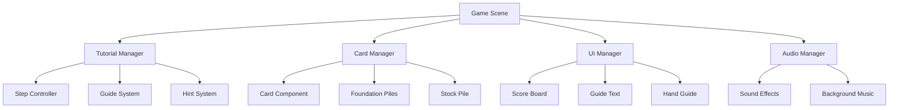

# 纸牌游戏教学关卡需求文档

## 文档信息
- **项目名称**: Solitaire Playable 教学关卡
- **文档版本**: v1.0
- **创建日期**: 2025-01-21
- **最后更新**: 2025-01-21

---

## 1. 项目概述

### 1.1 项目背景
基于现有的纸牌游戏（Klondike Solitaire），开发一个完整的教学关卡系统，通过7步渐进式引导帮助新手玩家快速掌握游戏规则和操作技巧。

### 1.2 项目目标
- **主要目标**: 创建直观易懂的教学系统，降低新手玩家的学习门槛
- **用户体验目标**: 通过分步引导和实时反馈，让玩家在3-5分钟内掌握基本玩法
- **业务目标**: 提高玩家留存率和游戏完成度

### 1.3 技术栈
- **游戏引擎**: Phaser 3.70+
- **开发语言**: TypeScript 5.0+
- **构建工具**: Vite 4.0+
- **UI框架**: Phaser原生UI系统
- **音频处理**: Phaser Audio API
- **国际化**: 自定义i18n系统

### 1.4 目标平台
- **主要平台**: Web浏览器（桌面端和移动端）
- **屏幕适配**: 支持横屏和竖屏自适应
- **分辨率支持**: 
  - 竖屏: 1080 x 2160 像素
  - 横屏: 2160 x 1080 像素

---
## 2. 牌局配置

### 2.1 整体布局结构

教学关卡采用标准的Klondike纸牌布局，包含以下区域：

#### 2.1.1 游戏区域组成
- **基础牌堆区域（Foundation）**: 4个位置，用于按花色从A到K排列卡牌
- **库存牌堆区域（Stock）**: 剩余卡牌的存放位置
- **翻牌区域（Waste）**: 从库存翻出的卡牌临时存放
- **游戏列区域（Tableau）**: 7列卡牌，主要游戏区域

#### 2.1.2 7列游戏区域详细配置

标准Klondike纸牌布局，从左到右卡牌数量依次递增，每列详细配置如下：

#### 2.1.1 牌局总览图

```
游戏布局示意图:

基础牌堆区域:                    库存区域:
┌─────┬─────┬─────┬─────┐       ┌─────┬─────┐
│  ♥  │  ♦  │  ♣  │  ♠  │       │Stock│Waste│
│ 空  │ 空  │ 空  │ 空  │       │ 24张│ 空  │
└─────┴─────┴─────┴─────┘       └─────┴─────┘

游戏列区域 (Tableau):
┌─────┬─────┬─────┬─────┬─────┬─────┬─────┐
│ 列1 │ 列2 │ 列3 │ 列4 │ 列5 │ 列6 │ 列7 │
├─────┼─────┼─────┼─────┼─────┼─────┼─────┤
│ ♠K  │ ♦6  │ ♣5  │ ♥4  │ ♠3  │ ♣2  │ ♥A  │
│     │ ♥Q  │ ♦9  │ ♣8  │ ♥7  │ ♠6  │ ♠5  │
│     │     │ ♠J  │ ♦K  │ ♣J  │ ♥10 │ ♦8  │
│     │     │     │ ♥10 │ ♦Q  │ ♣K  │ ♣Q  │
│     │     │     │     │ ♠9  │ ♦A  │ ♠K  │
│     │     │     │     │     │ ♥8  │ ♦3  │
│     │     │     │     │     │     │ ♠7  │
└─────┴─────┴─────┴─────┴─────┴─────┴─────┘
  1张   2张   3张   4张   5张   6张   7张

说明:
- 粗体显示的是正面朝上的卡牌
- 其他卡牌均为背面朝下
- ♥=红桃, ♦=方块, ♣=梅花, ♠=黑桃
```

**第1列（最左侧）**
```
位置: 第1列
卡牌数量: 1张
详细配置:
- 第1张(底牌): 黑桃K (正面朝上)
```

**第2列**
```
位置: 第2列
卡牌数量: 2张
详细配置:
- 第1张(底层): 方块6 (背面朝下)
- 第2张(底牌): 红桃Q (正面朝上)
```

**第3列**
```
位置: 第3列
卡牌数量: 3张
详细配置:
- 第1张(底层): 梅花5 (背面朝下)
- 第2张(中层): 方块9 (背面朝下)
- 第3张(底牌): 黑桃J (正面朝上)
```

**第4列**
```
位置: 第4列
卡牌数量: 4张
详细配置:
- 第1张(底层): 红桃4 (背面朝下)
- 第2张: 梅花8 (背面朝下)
- 第3张: 方块K (背面朝下)
- 第4张(底牌): 红桃10 (正面朝上)
```

**第5列**
```
位置: 第5列
卡牌数量: 5张
详细配置:
- 第1张(底层): 黑桃3 (背面朝下)
- 第2张: 红桃7 (背面朝下)
- 第3张: 梅花J (背面朝下)
- 第4张: 方块Q (背面朝下)
- 第5张(底牌): 黑桃9 (正面朝上)
```

**第6列**
```
位置: 第6列
卡牌数量: 6张
详细配置:
- 第1张(底层): 梅花2 (背面朝下)
- 第2张: 黑桃6 (背面朝下)
- 第3张: 红桃10 (背面朝下)
- 第4张: 梅花K (背面朝下)
- 第5张: 方块A (背面朝下)
- 第6张(底牌): 红桃8 (正面朝上)
```

**第7列（最右侧）**
```
位置: 第7列
卡牌数量: 7张
详细配置:
- 第1张(底层): 红桃A (背面朝下)
- 第2张: 黑桃5 (背面朝下)
- 第3张: 方块8 (背面朝下)
- 第4张: 梅花Q (背面朝下)
- 第5张: 黑桃K (背面朝下)
- 第6张: 方块3 (背面朝下)
- 第7张(底牌): 黑桃7 (正面朝上)
```

### 2.2 库存牌堆配置

**剩余卡牌（24张）**
库存牌堆包含未分配到7列中的剩余卡牌，共24张：

```
游戏列总计: 1+2+3+4+5+6+7 = 28张
库存牌堆: 52-28 = 24张
```

#### 2.2.1 库存牌堆详细配置

**库存牌堆卡牌列表（从顶部到底部）**：
```
第1张(顶部): 黑桃A
第2张: 梅花A
第3张: 红桃2
第4张: 黑桃2
第5张: 方块2
第6张: 梅花3
第7张: 红桃3
第8张: 黑桃4
第9张: 方块4
第10张: 红桃5
第11张: 黑桃5
第12张: 方块5
第13张: 梅花6
第14张: 红桃6
第15张: 方块7
第16张: 梅花7
第17张: 黑桃8
第18张: 梅花9
第19张: 黑桃10
第20张: 方块10
第21张: 红桃J
第22张: 黑桃Q
第23张: 梅花4
第24张(底部): 方块J
```

#### 2.2.2 抽牌机制

**翻牌规则**：
- 每次点击库存牌堆翻出1张牌
- 翻出的牌放置在翻牌区域（Waste Pile）
- 翻牌区域最多显示3张牌，只有顶部牌可以移动
- 当库存牌堆翻完后，可以重新翻牌（将翻牌区域的牌重新放回库存）

**抽牌顺序示例**：
```
第1次点击: 翻出黑桃A
第2次点击: 翻出梅花A（黑桃A被覆盖）
第3次点击: 翻出红桃2（梅花A被覆盖，黑桃A不可见）
第4次点击: 翻出黑桃2（红桃2被覆盖，梅花A可见，黑桃A不可见）
...以此类推
```

**重新翻牌**：
- 当库存牌堆为空时，点击空的库存位置
- 将翻牌区域的所有牌按相反顺序重新放回库存牌堆
- 重新开始翻牌循环

### 2.3 基础牌堆配置

#### 2.3.1 基础牌堆布局
```
位置: 游戏区域右上角
数量: 4个牌堆
排列: 水平排列
花色顺序: 红桃、方块、梅花、黑桃（从左到右）
```

#### 2.3.2 各花色牌堆初始状态
```
红桃基础牌堆: 空（等待红桃A开始）
方块基础牌堆: 空（等待方块A开始）
梅花基础牌堆: 空（等待梅花A开始）
黑桃基础牌堆: 空（等待黑桃A开始）
```

#### 2.3.3 基础牌堆完成顺序
每个基础牌堆必须按以下顺序完成：
```
A → 2 → 3 → 4 → 5 → 6 → 7 → 8 → 9 → 10 → J → Q → K
```

### 2.4 翻牌区域配置

#### 2.4.1 翻牌区域布局
```
位置: 库存牌堆右侧
显示方式: 扇形展开
最大显示: 3张牌
可操作: 仅顶部牌可移动
```

#### 2.4.2 翻牌区域状态示例
```
初始状态: 空
第1次翻牌后: [黑桃A]
第2次翻牌后: [黑桃A] [梅花A] （梅花A在顶部）
第3次翻牌后: [黑桃A] [梅花A] [红桃2] （红桃2在顶部）
第4次翻牌后: [梅花A] [红桃2] [黑桃2] （黑桃2在顶部，黑桃A不可见）
```

### 2.5 教学关卡特殊配置

#### 2.5.1 初始可见卡牌
为了便于教学，以下卡牌在游戏开始时即为正面朝上：
- **第1列**: 黑桃K
- **第2列**: 红桃Q
- **第3列**: 黑桃J
- **第4列**: 红桃10
- **第5列**: 黑桃9
- **第6列**: 红桃8
- **第7列**: 黑桃7

#### 2.5.2 教学步骤对应卡牌操作

**步骤1-2: 游戏介绍和规则说明**
- 无需具体操作，展示游戏界面和规则

**步骤3: A牌放置引导**
```
目标操作: 将黑桃A放入黑桃基础牌堆
具体步骤:
1. 点击库存牌堆
2. 翻出黑桃A（第1张牌）
3. 点击黑桃A

### 2.6 牌局数据结构

#### 2.6.1 JSON配置格式
为便于开发实现，提供标准的JSON配置格式：

```json
{
  "gameLayout": {
    "tableau": [
      {
        "column": 1,
        "cards": [
          {"suit": "spades", "value": "K", "faceUp": true}
        ]
      },
      {
        "column": 2,
        "cards": [
          {"suit": "diamonds", "value": "6", "faceUp": false},
          {"suit": "hearts", "value": "Q", "faceUp": true}
        ]
      },
      {
        "column": 3,
        "cards": [
          {"suit": "clubs", "value": "5", "faceUp": false},
          {"suit": "diamonds", "value": "9", "faceUp": false},
          {"suit": "spades", "value": "J", "faceUp": true}
        ]
      }
      // ... 其他列配置
    ],
    "stock": [
      {"suit": "spades", "value": "A"},
      {"suit": "clubs", "value": "A"},
      {"suit": "hearts", "value": "2"},
      {"suit": "spades", "value": "2"}
      // ... 其他库存牌
    ],
    "foundations": {
      "hearts": [],
      "diamonds": [],
      "clubs": [],
      "spades": []
    },
    "waste": []
  }
}
```

#### 2.6.2 卡牌标识规范
```
花色标识:
- hearts (红桃) = "h"
- diamonds (方块) = "d" 
- clubs (梅花) = "c"
- spades (黑桃) = "s"

数值标识:
- A, 2, 3, 4, 5, 6, 7, 8, 9, 10, J, Q, K

完整卡牌ID示例:
- 红桃A = "hA"
- 黑桃K = "sK"
- 方块10 = "d10"
```

### 2.7 教学关卡胜利路径

#### 2.7.1 最优解路径示例
基于当前牌局配置的一种可能的胜利路径：

```
步骤序列:
1. 翻出黑桃A → 放入黑桃基础牌堆
2. 红桃8移动到黑桃9上 → 翻开方块A
3. 方块A → 放入方块基础牌堆
4. 翻出梅花A → 放入梅花基础牌堆
5. 黑桃7移动到红桃8上 → 翻开方块3
6. 继续翻牌寻找红桃A
7. 红桃A → 放入红桃基础牌堆
8. 逐步构建基础牌堆...
```

#### 2.7.2 关键移动提示
```
优先级操作:
1. 优先将A牌放入基础牌堆
2. 优先翻开隐藏的卡牌
3. 优先移动大牌到小牌上（降序排列）
4. 优先清空游戏列以放置K牌
5. 合理利用库存牌堆的循环机制
```

### 2.8 常见问题和解决方案

#### 2.8.1 教学中可能遇到的问题
```
问题1: 玩家不理解颜色交替规则
解决方案: 在引导动画中突出显示颜色对比，添加颜色提示

问题2: 玩家不知道如何使用库存牌堆
解决方案: 专门的翻牌教学步骤，展示翻牌区域的使用

问题3: 玩家混淆基础牌堆和游戏列的规则
解决方案: 用不同的视觉效果区分两种区域的规则
```

#### 2.8.2 技术实现注意事项
```
性能优化:
- 使用对象池管理卡牌实例
- 预加载所有卡牌纹理
- 优化动画性能，避免同时播放过多动画

用户体验:
- 提供撤销功能（至少1步）
- 添加自动完成功能（当所有牌都翻开且有明确移动路径时）
- 支持双击快速移动到最佳位置

调试功能:
- 开发模式下显示所有隐藏卡牌
- 提供跳过教学的选项
- 添加重置牌局的功能
```

4. 黑桃A自动移动到黑桃基础牌堆
引导动画: 手指在库存牌堆和黑桃基础牌堆间移动
```

**步骤4: 牌堆操作引导**
```
目标操作: 将红桃8移动到黑桃9上
具体步骤:
1. 点击第6列的红桃8
2. 红桃8移动到第5列的黑桃9上
3. 第6列自动翻开下一张牌（方块A）
引导动画: 手指在红桃8和黑桃9之间移动
```

**步骤5: 库存翻牌引导**
```
目标操作: 继续翻牌寻找可用卡牌
具体步骤:
1. 点击库存牌堆
2. 翻出梅花A（第2张牌）
3. 展示翻牌区域的使用方法
引导动画: 手指在库存牌堆上下移动
```

**步骤6: 牌堆间移动引导**
```
目标操作: 将黑桃7移动到红桃8上
具体步骤:
1. 点击第7列的黑桃7
2. 黑桃7移动到第5列的红桃8上（红桃8现在在黑桃9上）
3. 第7列自动翻开下一张牌（方块3）
引导动画: 手指在黑桃7和红桃8之间移动
```

**步骤7: 自由游戏**
```
目标: 玩家自由操作完成游戏
可用操作:
- 继续翻牌寻找需要的卡牌
- 将翻开的方块A放入方块基础牌堆
- 移动游戏列中的卡牌
- 逐步完成所有基础牌堆
```

#### 2.3.3 胜利条件配置
- **基础牌堆完成**: 4个花色各自从A到K完整排列
- **游戏列清空**: 所有游戏列卡牌全部移动到基础牌堆
- **所有牌面朝上**: 游戏过程中所有背面牌都已翻开

### 2.4 卡牌移动规则

#### 2.4.1 游戏列规则
- **降序排列**: 卡牌必须按数值从大到小排列（K-Q-J-10-9-8-7-6-5-4-3-2-A）
- **颜色交替**: 红色和黑色卡牌必须交替放置
- **空列规则**: 只有K可以放入空的游戏列
- **多牌移动**: 可以同时移动符合规则的连续卡牌序列

#### 2.4.2 基础牌堆规则
- **花色匹配**: 只能放置相同花色的卡牌
- **升序排列**: 必须从A开始，按A-2-3-4-5-6-7-8-9-10-J-Q-K顺序
- **单牌移动**: 每次只能移动一张卡牌

#### 2.4.3 特殊规则
- **自动翻牌**: 当游戏列顶部的背面牌被移走后，自动翻开下一张背面牌
- **双击移动**: 双击卡牌可自动移动到最合适的位置
- **撤销功能**: 支持撤销上一步操作（可选功能）

---


## 2. 功能需求

### 2.1 教学流程设计

#### 2.1.1 七步教学流程

**第一步: 游戏介绍**
- **引导文案**: "This classical card game is also called Klondike or Patience"
- **显示时长**: 3秒自动进入下一步
- **交互方式**: 无需用户操作，自动播放
- **视觉效果**: 文案淡入淡出动画

**第二步: 规则说明**
- **引导文案**: "Try to build all four suits up from ace to king in separate pil"
- **显示时长**: 5秒或用户点击继续
- **交互方式**: 点击任意位置继续
- **视觉效果**: 高亮显示基础牌堆区域

**第三步: A牌放置引导**
- **引导文案**: "Let's put Ace to the foundation"
- **目标操作**: 将任意A牌拖拽到对应花色的基础牌堆
- **引导动画**: 手指图标在A牌和目标位置间循环移动
- **完成条件**: 成功放置A牌
- **错误处理**: 错误操作时卡牌震动提示

**第四步: 牌堆操作引导**
- **引导文案**: "Good, let's put this card to the pile"
- **目标操作**: 将明牌移动到合适的牌堆位置
- **引导动画**: 手指图标指示可移动的卡牌和目标位置
- **完成条件**: 成功移动卡牌到牌堆
- **自动翻牌**: 移动后自动翻开下层卡牌

**第五步: 库存牌堆引导**
- **引导文案**: "Hmmm, now try to look in the stock"
- **目标操作**: 点击库存牌堆翻开新卡牌
- **引导动画**: 手指图标在库存牌堆上下移动
- **完成条件**: 成功翻开库存卡牌
- **视觉反馈**: 翻牌动画和音效

**第六步: 牌堆间移动引导**
- **引导文案**: "Awesome! Now try to move this card from this pile to another"
- **目标操作**: 在不同牌堆间移动卡牌
- **引导动画**: 手指图标在源牌堆和目标牌堆间移动
- **完成条件**: 成功完成牌堆间移动
- **规则检查**: 确保移动符合游戏规则

**第七步: 自由游戏**
- **引导文案**: "Perfect! Can you try to complete the puzzle now?"
- **目标操作**: 玩家自由操作完成游戏
- **引导策略**: 5秒无操作时显示提示
- **结束条件**: 完成游戏或达到50步上限

#### 2.1.2 引导系统特性

**智能提示系统**
- **触发条件**: 5秒无有效操作
- **提示内容**: 
  - 优先提示可移动的卡牌
  - 无可移动卡牌时提示翻牌
  - 显示最优移动路径
- **消失条件**: 任意有效点击

**错误处理机制**
- **无效点击**: 卡牌震动动画 + 错误音效
- **错误移动**: 卡牌自动回到原位置
- **超时处理**: 自动显示下一步提示

### 2.2 交互设计

#### 2.2.1 输入方式
- **主要交互**: 点击操作（支持触摸和鼠标）
- **拖拽支持**: 卡牌可拖拽移动（可选功能）
- **快捷操作**: 双击自动移动到最佳位置

#### 2.2.2 反馈系统
- **视觉反馈**: 
  - 卡牌高亮显示可移动状态
  - 目标位置预览效果
  - 成功操作的粒子特效
- **音频反馈**:
  - 翻牌音效
  - 成功放置音效
  - 错误操作音效
  - 胜利音效

#### 2.2.3 动画系统
- **卡牌移动**: 100ms平滑过渡动画
- **翻牌动画**: 100ms翻转效果
- **引导手指**: 750ms循环移动动画
- **UI动画**: 计分板数字缩放动画（400ms）

### 2.3 UI需求

#### 2.3.1 界面布局

**竖屏布局 (1080 x 2160)**
- **计分板区域**: 顶部居中，y=30
- **游戏区域**: 中央，高度1760px，左右边距15px
- **引导文字区**: x=540, y=990, 高度400px
- **下载按钮**: 底部居中，y=游戏区域底部+30px
- **游戏图标**: 右下角，200x200px，边距10px

**横屏布局 (2160 x 1080)**
- **计分板区域**: 右上角，x=1810, y=70
- **游戏区域**: 中央，高度900px，左右边距580px
- **引导文字区**: x=1080, y=580, 宽度830px，高度320px
- **下载按钮**: 底部居中
- **游戏图标**: 右下角，200x200px

#### 2.3.2 UI组件规范

**计分板组件**
- **显示内容**: 时间、分数、步数
- **更新频率**: 实时更新
- **动画效果**: 数值变化时的缩放动画
- **字体规范**: 42px粗体，黑色

**引导文字组件**
- **显示方式**: 图片形式的预制文案
- **切换动画**: 淡入淡出效果（300ms）
- **背景**: 半透明黑色背景
- **位置**: 根据屏幕方向自适应

**手指引导组件**
- **图片规格**: 60x80px PNG格式
- **动画模式**: 
  - 平移模式：在起点和终点间循环移动
  - 缩放模式：80%-120%缩放循环
- **显示时机**: 根据教学步骤自动显示
- **消失条件**: 用户操作后立即消失

---

## 3. 技术需求

### 3.1 架构设计

#### 3.1.1 系统架构



#### 3.1.2 核心组件设计

**TutorialManager 教学管理器**
```typescript
class TutorialManager {
    private currentStep: number = 0;
    private steps: TutorialStep[] = [];
    private isActive: boolean = false;
    
    public startTutorial(): void;
    public nextStep(): void;
    public showHint(): void;
    public completeTutorial(): void;
}
```

**TutorialStep 教学步骤**
```typescript
interface TutorialStep {
    id: number;
    textKey: string;
    targetAction: ActionType;
    guideAnimation: GuideAnimationType;
    completionCondition: () => boolean;
    onComplete: () => void;
}
```

**GuideSystem 引导系统**
```typescript
class GuideSystem {
    private handGuide: Phaser.GameObjects.Image;
    private currentAnimation: Phaser.Tweens.Tween;
    
    public showGuide(from: Point, to: Point): void;
    public hideGuide(): void;
    public playMoveAnimation(): void;
    public playScaleAnimation(): void;
}
```

### 3.2 组件规划

#### 3.2.1 新增组件

**TutorialOverlay 教学覆盖层**
- **功能**: 显示教学文案和遮罩效果
- **属性**: 文案图片、背景透明度、显示动画
- **方法**: show(), hide(), updateText()

**StepIndicator 步骤指示器**
- **功能**: 显示当前教学进度
- **样式**: 7个圆点，当前步骤高亮
- **位置**: 引导文字下方

**HintButton 提示按钮**
- **功能**: 主动获取操作提示
- **触发**: 点击显示当前最佳操作
- **冷却**: 5秒冷却时间

#### 3.2.2 现有组件扩展

**Card 组件扩展**
- **新增属性**: isHighlighted, canMove, tutorialTarget
- **新增方法**: highlight(), unhighlight(), setTutorialTarget()
- **动画增强**: 添加高亮边框动画

**Game Scene 扩展**
- **教学模式**: 添加tutorialMode状态
- **事件监听**: 监听教学相关事件
- **状态管理**: 管理教学进度和游戏状态

### 3.3 集成方案

#### 3.3.1 与现有代码集成

**事件系统集成**
```typescript
// 扩展现有EventBus
EventBus.emit('tutorial:stepComplete', stepId);
EventBus.emit('tutorial:actionRequired', actionType);
EventBus.emit('tutorial:hintRequested');
```

**状态管理集成**
```typescript
// 扩展游戏状态
interface GameState {
    // 现有状态...
    tutorialMode: boolean;
    currentTutorialStep: number;
    tutorialCompleted: boolean;
}
```

**资源管理集成**
- **图片资源**: 集成到现有Preloader场景
- **音效资源**: 使用现有音频管理系统
- **文本资源**: 集成到现有i18n系统

#### 3.3.2 配置系统

**教学配置文件**
```typescript
export const tutorialConfig = {
    steps: [
        {
            id: 1,
            textKey: 'tutorial.intro',
            duration: 3000,
            autoAdvance: true
        },
        // ... 其他步骤配置
    ],
    animations: {
        handGuide: {
            duration: 750,
            easing: 'Sine.easeInOut'
        }
    }
};
```

---

## 4. 资源清单

### 4.1 图片资源

#### 4.1.1 现有可用资源
- **背景图片**: bg横.png (2160x1080), bg竖.png (1080x2160)
- **卡牌资源**: 牌面.png, 牌背.png, 花色图片, 数值图片
- **UI元素**: 计分板图片, 按钮图片, 图标
- **引导文案**: 7张预制文案图片（已提供）
- **手指图标**: hand.png (60x80px)

#### 4.1.2 需要新增的资源
- **步骤指示器**: 7个圆点的进度条图片
- **高亮边框**: 卡牌高亮状态的边框效果
- **提示按钮**: 灯泡图标或问号图标
- **遮罩背景**: 半透明黑色背景图片

#### 4.1.3 资源规格要求
- **格式**: PNG（支持透明度）或JPG（背景图）
- **分辨率**: 适配1080p和2160p显示
- **压缩**: PNG使用8位色深，JPG压缩率85%
- **命名规范**: tutorial_[功能]_[状态].png

### 4.2 音效资源

#### 4.2.1 现有音效
- **背景音乐**: bgm.mp3
- **翻牌音效**: 翻牌.mp3
- **成功音效**: 入槽.mp3
- **错误音效**: 错误.mp3
- **胜利音效**: 胜利结算.mp3

#### 4.2.2 需要新增音效
- **步骤完成**: 轻快的提示音
- **教学开始**: 欢迎音效
- **提示显示**: 柔和的提醒音

#### 4.2.3 音效规格
- **格式**: MP3或OGG
- **采样率**: 44.1kHz
- **比特率**: 128kbps
- **时长**: 0.5-2秒（音效），循环（背景音乐）

### 4.3 文案资源

#### 4.3.1 教学文案（英文）
1. "This classical card game is also called Klondike or Patience"
2. "Try to build all four suits up from ace to king in separate piles"
3. "Let's put Ace to the foundation"
4. "Good, let's put this card to the pile"
5. "Hmmm, now try to look in the stock"
6. "Awesome! Now try to move this card from this pile to another"
7. "Perfect! Can you try to complete the puzzle now?"

#### 4.3.2 提示文案
- "Tap here to continue"
- "Try again"
- "Well done!"
- "Need a hint?"

#### 4.3.3 多语言支持
- **主要语言**: 英文（默认）
- **扩展语言**: 中文、日文、韩文（后期支持）
- **文案格式**: JSON配置文件

---

## 5. 开发计划

### 5.1 开发优先级

#### 5.1.1 P0 核心功能（第1周）
- **教学管理器**: 基础的步骤控制和状态管理
- **引导系统**: 手指动画和文案显示
- **基础交互**: 点击检测和步骤推进
- **资源集成**: 图片和音效资源加载

#### 5.1.2 P1 增强功能（第2周）
- **智能提示**: 5秒无操作提示系统
- **错误处理**: 完善的错误反馈机制
- **动画优化**: 流畅的过渡动画
- **音效集成**: 完整的音频反馈

#### 5.1.3 P2 优化功能（第3周）
- **性能优化**: 内存管理和资源优化
- **兼容性测试**: 多设备和浏览器测试
- **用户体验**: 细节优化和打磨
- **多语言支持**: 国际化功能

### 5.2 里程碑规划

#### 5.2.1 Alpha版本（第1周末）
- **功能范围**: 基础7步教学流程
- **质量标准**: 核心功能可用，无阻塞性bug
- **测试范围**: 基础功能测试
- **交付物**: 可演示的原型版本

#### 5.2.2 Beta版本（第2周末）
- **功能范围**: 完整教学系统 + 智能提示
- **质量标准**: 用户体验流畅，错误处理完善
- **测试范围**: 完整功能测试 + 用户体验测试
- **交付物**: 接近最终版本的测试版

#### 5.2.3 Release版本（第3周末）
- **功能范围**: 所有功能 + 性能优化
- **质量标准**: 生产环境可用，性能达标
- **测试范围**: 全面测试 + 压力测试
- **交付物**: 最终发布版本

### 5.3 交付物清单

#### 5.3.1 代码交付物
- **源代码**: 完整的TypeScript源码
- **构建脚本**: Vite构建配置
- **类型定义**: 完整的TypeScript类型定义
- **文档**: 代码注释和API文档

#### 5.3.2 资源交付物
- **图片资源**: 优化后的游戏图片
- **音效资源**: 压缩后的音频文件
- **配置文件**: 游戏配置和本地化文件
- **字体文件**: 自定义字体（如需要）

#### 5.3.3 文档交付物
- **技术文档**: 架构设计和实现说明
- **用户手册**: 教学系统使用指南
- **测试报告**: 功能测试和性能测试报告
- **部署指南**: 生产环境部署说明

---

## 6. 验收标准

### 6.1 功能验收

#### 6.1.1 教学流程验收
- **步骤完整性**: 7个教学步骤按序执行
- **引导准确性**: 手指动画指向正确位置
- **文案显示**: 每步文案正确显示和切换
- **操作检测**: 正确识别用户操作并推进步骤
- **错误处理**: 错误操作有明确反馈

#### 6.1.2 交互验收
- **点击响应**: 点击延迟 < 100ms
- **动画流畅**: 60fps流畅动画，无卡顿
- **音效同步**: 音效与操作同步，无延迟
- **状态一致**: 游戏状态与UI显示一致
- **边界处理**: 边界情况处理正确

#### 6.1.3 UI验收
- **布局适配**: 横竖屏自动适配
- **分辨率支持**: 支持目标分辨率显示
- **字体清晰**: 文字清晰可读，无模糊
- **颜色对比**: 满足可访问性要求
- **响应式**: UI元素响应式缩放

### 6.2 性能要求

#### 6.2.1 运行性能
- **帧率**: 稳定60fps，99%时间 > 55fps
- **内存使用**: 峰值内存 < 200MB
- **加载时间**: 首次加载 < 3秒
- **资源大小**: 总资源包 < 10MB
- **CPU使用**: 平均CPU使用率 < 30%

#### 6.2.2 网络性能
- **资源压缩**: 图片压缩率 > 70%
- **缓存策略**: 静态资源缓存1年
- **CDN支持**: 支持CDN分发
- **离线支持**: 支持离线游戏（可选）

### 6.3 兼容性要求

#### 6.3.1 浏览器兼容性
- **桌面浏览器**: Chrome 90+, Firefox 88+, Safari 14+, Edge 90+
- **移动浏览器**: iOS Safari 14+, Android Chrome 90+
- **WebGL支持**: 要求WebGL 1.0支持
- **音频支持**: 要求Web Audio API支持

#### 6.3.2 设备兼容性
- **桌面设备**: Windows 10+, macOS 10.15+, Linux
- **移动设备**: iOS 14+, Android 8.0+
- **屏幕尺寸**: 320px - 2560px宽度
- **触摸支持**: 支持触摸和鼠标操作

#### 6.3.3 性能基准
- **低端设备**: iPhone 8, Android 中端机型
- **网络环境**: 3G网络环境下可用
- **存储空间**: 本地存储 < 50MB
- **电池消耗**: 合理的电池使用率

### 6.4 用户体验验收

#### 6.4.1 学习曲线
- **完成时间**: 新手玩家3-5分钟完成教学
- **理解度**: 90%玩家能理解基本规则
- **操作成功率**: 95%操作能正确执行
- **错误恢复**: 错误操作后能快速恢复

#### 6.4.2 可用性测试
- **直观性**: 无需额外说明即可操作
- **一致性**: 交互方式与游戏主体一致
- **反馈及时**: 操作反馈及时明确
- **容错性**: 对误操作有良好容错

#### 6.4.3 满意度指标
- **完成率**: 教学完成率 > 85%
- **跳过率**: 教学跳过率 < 15%
- **重复率**: 需要重复教学的比例 < 10%
- **用户评分**: 用户体验评分 > 4.0/5.0

---

## 7. 风险评估与应对

### 7.1 技术风险

#### 7.1.1 性能风险
- **风险描述**: 移动设备性能不足导致卡顿
- **影响程度**: 高
- **应对措施**: 
  - 资源优化和压缩
  - 对象池管理
  - 分帧加载
  - 降级方案

#### 7.1.2 兼容性风险
- **风险描述**: 老旧设备或浏览器不兼容
- **影响程度**: 中
- **应对措施**:
  - 渐进式增强
  - Polyfill支持
  - 降级UI
  - 兼容性检测

### 7.2 项目风险

#### 7.2.1 进度风险
- **风险描述**: 开发进度延期
- **影响程度**: 中
- **应对措施**:
  - 功能优先级管理
  - 并行开发
  - 每日进度跟踪
  - 缓冲时间预留

#### 7.2.2 质量风险
- **风险描述**: 用户体验不达预期
- **影响程度**: 高
- **应对措施**:
  - 早期用户测试
  - 迭代优化
  - A/B测试
  - 数据驱动改进

---

## 8. 总结

本需求文档详细规划了纸牌游戏教学关卡的完整实现方案，包括：

1. **完整的7步教学流程设计**，从游戏介绍到自由游戏
2. **详细的技术实现方案**，包括架构设计和组件规划
3. **全面的资源清单**，涵盖图片、音效、文案等所有物料
4. **明确的开发计划**，分为3周3个里程碑
5. **严格的验收标准**，确保功能、性能、兼容性达标

该文档为开发团队提供了清晰的实施指导，确保教学关卡能够有效提升新手玩家的游戏体验，达到预期的业务目标。

---

**文档状态**: ✅ 已完成  
**审核状态**: 🔄 待审核  
**实施状态**: ⏳ 待开始